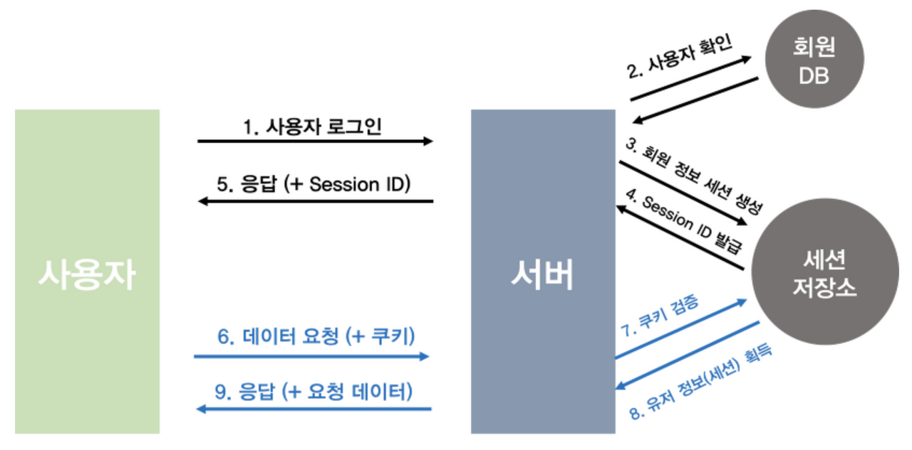
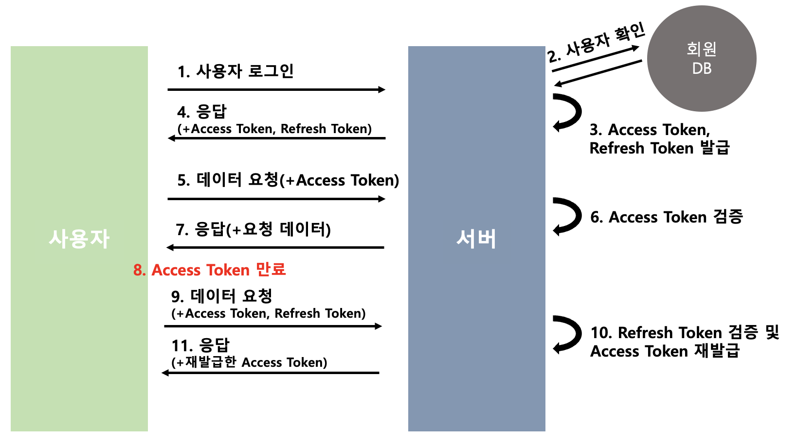
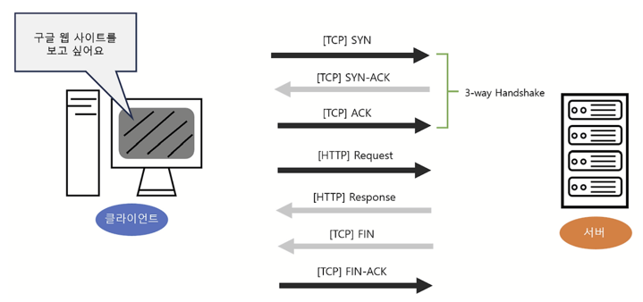
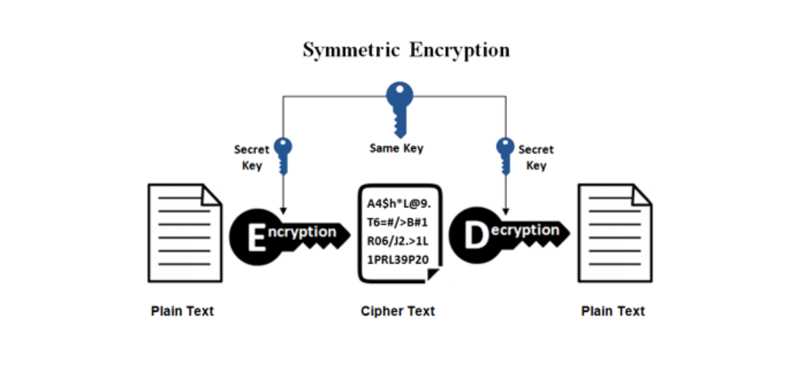
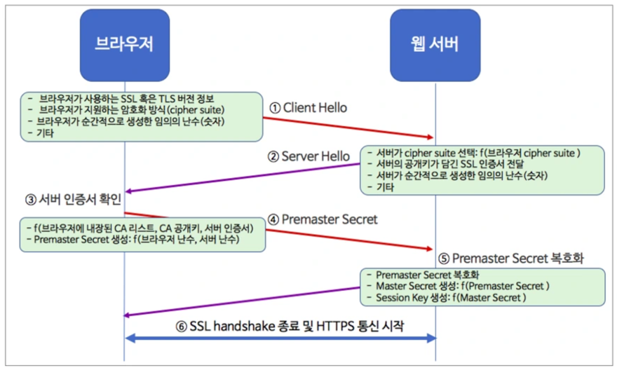
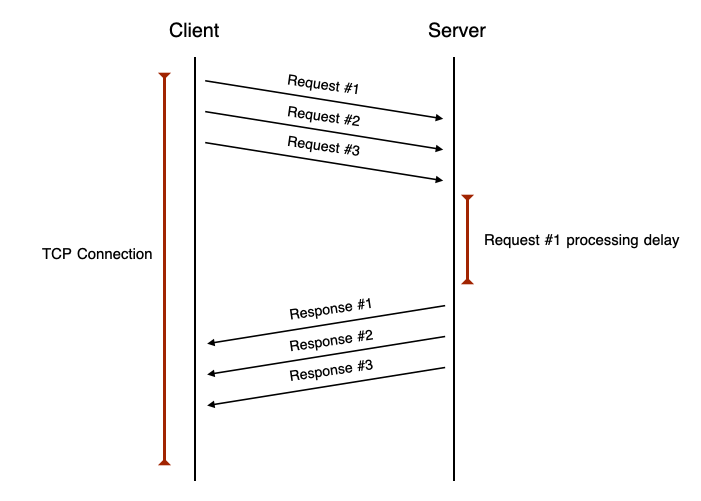
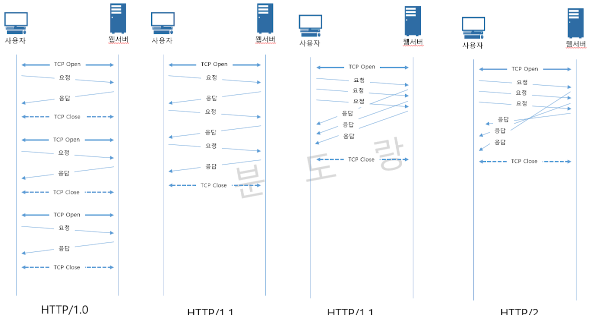
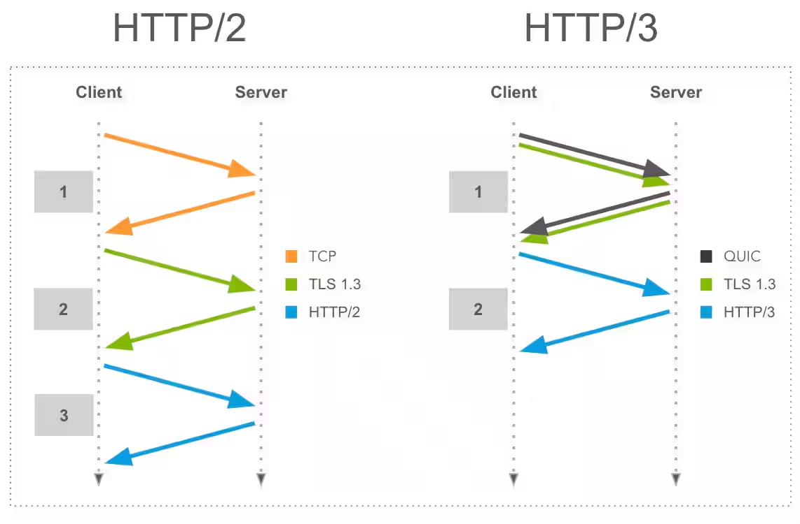

# 네트워크

## 1. 쿠키와 세션의 차이에 대해 설명해 주세요.
주된 차이점은 **저장 위치**와 **라이프 사이클**    

#### 쿠키
- 클라이언트의 로컬에 저장되는 키와 값이 들어있는 작은 데이터 파일
- 사용자 인증이 유효한 시간을 명시할 수 있으며 유효시간이 정해지면 브라우저가 종료되어도 인증이 유지됨
- 도메인당 가질 수 있는 쿠키의 개수와 쿠키의 최대 용량이 정해져있음
- Response Header에 Set-Cookie 속성을 사용해 클라이언트에 쿠키 생성 가능
- 용도 | 로그인 상태 유지 (자동 로그인/아이디 저장 등), 사용자 맞춤 환경(다크모드 여부/팝업 안 보기 등)
> ##### 쿠키의 동작 과정 
> 1. 클라이언트가 페이지 요청
> 2. 웹 서버는 쿠키를 생성
> 3. HTTP 응답 헤더에 쿠키를 포함시켜 전송
> 4. 클라이언트는 쿠키를 로컬 PC에 저장하고 있다가 이후 서버에 요청할 때 쿠키를 포함시켜 요청
> 5. 서버에서 쿠키를 읽고 이전 상태 정보를 변경할 필요가 있으면 쿠키를 업데이트 후 변경된 쿠키를 응답 헤더에 포함시켜 전송함

#### 세션
- 클라이언트가 웹 서버에 접속한 시점부터 웹 브라우저를 종료해 연결을 끊어내는 시점까지의 일정 시간 동안 같은 클라이언트로부터 들어오는 일련의 요구를 하나의 상태로 보고, 그 상태를 유지시키는 기술
- 쿠키와 달리 웹 서버에 웹 컨테이너의 상태를 유지하기 위한 정보 저장
- 세션 데이터는 서버 측 저장소에 저장하고, 세션 ID만 클라이언트 쿠키에 저장하므로 그냥 쿠키만 사용하는 것보다 보안이 좋음
- 세션 타임아웃으로 서버에서 세션 데이터를 삭제하거나 클라이언트가 브라우저를 종료해서 세션 쿠키가 삭제되는 경우에 소멸됨
- 각 클라이언트에게 고유 Session ID 부여
- 용도 | 로그인 인증 정보, 사용자별 중요한 상태 관리
> ##### 세션의 동작 과정
> 1. 클라이언트가 페이지 요청
> 2. 서버는 접근한 클라이언트의 Request-Header 필드인 Cookie를 확인하여 클라이언트가 Session ID를 보냈는지 확인
> 3. Session ID가 존재하지 않는다면 웹 서버는 Session ID를 생성해 클라이언트에게 전송
> 4. 클라이언트는 서버로부터 받은 Session ID를 쿠키에 저장, 다음 요청부터 해당 값을 포함하여 전송
> 5. 서버는 전달받은 Session ID로 Session에 있는 클라이언트 정보를 가지고 요청을 처리 후 응답

### ⁃ 세션 방식의 로그인 과정에 대해 설명해 주세요.

#### 세션 방식의 로그인

1.	로그인 요청      
- 클라이언트가 아이디/비밀번호를 서버에 전송      
2.	인증 처리     
- 서버가 DB에서 사용자 정보 확인 → 성공 시 세션 생성      
- 세션에는 사용자 ID, 권한 등 상태 정보 저장       
3.	세션 ID 발급     
- 서버는 생성된 세션의 고유 ID를 클라이언트에 전달      
- 브라우저는 이 세션 ID를 세션 쿠키에 저장      
4.	인증 유지     
- 클라이언트가 이후 요청 시 쿠키에 세션 ID 포함 → 서버는 세션 저장소에서 해당 ID를 찾아 사용자 식별      
5.	만료/로그아웃     
- 세션 타임아웃이 지나거나 사용자가 로그아웃하면 서버에서 세션 삭제 → 세션 ID는 더 이상 유효하지 않음     

#### 토큰 방식의 로그인

1.	로그인 요청       
- 클라이언트가 아이디/비밀번호를 서버에 전송          
2.	인증 처리 & 토큰 발급       
- 서버가 DB에서 사용자 정보 확인 → 성공 시 토큰(JWT 등) 발급          
- 토큰 내부에는 사용자 ID, 권한, 만료 시간 등 정보가 **서명(Signature)**과 함께 담김          
3.	토큰 저장       
- 클라이언트는 토큰을 로컬스토리지, 세션스토리지, 혹은 쿠키에 저장          
4.	인증 유지       
- 이후 요청 시 Authorization: Bearer <token> 헤더에 토큰을 포함시켜 전달          
- 서버는 서명(Signature)을 검증하여 토큰이 위·변조되지 않았음을 확인 → 유저 인증 완료          
- 별도의 서버 세션 저장소 조회 없이 인증 가능.
5.	만료/로그아웃          
- 토큰에 포함된 **만료 시간(exp)**이 지나면 자동으로 무효화          
- 서버는 원칙적으로 상태를 저장하지 않기 때문에(logout 구현은 보통 refresh token 블랙리스트 등 별도 처리)          

### ⁃ HTTP의 특성인 Stateless에 대해 설명해 주세요.
서버가 클라이언트에서 보내준 정보를 저장하지 않고, 상태를 보존하지 않는다는 의미 → 수평 확장에 유리함

| stateful                                                   | stateless                                            |
|------------------------------------------------------------|------------------------------------------------------|
| 특정 서버가 특정 클라이언트의 정보를 갖고 있기 때문에 클라이언트는 항상 같은 서버에게 요청을 보내야 함 | 서버가 클라이언트의 상태를 저장하지 않기 때문에 클라이언트는 아무 서버에게나 요청을 보내도 됨 |
| 특정 서버에 장애 발생 시 해당 서버로 요청을 보내던 클라이언트의 정보를 잃게 될 것            | 특정 서버에 장애 발생 시 클라이언트의 요청은 다른 서버가 처리해주면 됨 |

> #### HTTP의 특성
> 1. 클라이언트 - 서버 구조 | 클라이언트에서 요청을 보내면 서버는 그에 따른 응답을 보내는 구조를 갖는다.
> 2. Stateless | 서버는 클라이언트의 상태를 저장하지 않는다.
> 3. Connectionless | 클라이언트의 요청 - 서버의 응답 이후에는 연결을 종료한다.

### ⁃ Stateless의 의미를 살펴보면, 세션은 적절하지 않은 인증 방법 아닌가요?
세션 인증에서는 서버가 클라이언트의 상태를 저장하기 때문에 Stateful하다고 볼 수 있으며, Stateless 원칙에 충실하려면 JWT 등을 이용한 토큰 인증을 사용하는 것이 맞다.     
하지만 보안 측면에서 토큰은 클라이언트의 모든 정보가 담겨 있으므로 탈취 시 위험이 크다는 단점이 있고, 반면 세션은 서버가 상태를 직접 관리하기 때문에 필요하다면 즉시 무효화 가능하다는 장점이 있다.      
또한 세션을 사용하면 특정 사용자의 세션을 강제로 만료시키거나 권한을 즉시 변경하는 것이 가능하다.         
다만 소규모, 단일 서버 환경에서는 세션 관리 비용이 크게 부담되지 않으나 대규모, 분산환경에서는 세션 공유 및 동기화가 어렵기 때문에 Stateless한 토큰 인증 방식이 선호된다. 

### ⁃ 규모가 커져 서버가 여러 개가 된다면, 세션을 어떻게 관리할 수 있을까요?

#### Sticky Session
- 웹 애플리케이션의 로드 밸런싱에서 사용되는 기술
- 클라이언트의 요청이 항상 특정 서버로 라우팅되도록 보장
- 서버 부하 불균형, 서버 장애 시 문제, 서버 확장 시 동기화 및 관리의 어려움 등의 문제점이 존재

#### Session Clustering
- 웹 애플리케이션 환경에서 세션 데이터를 여러 서버 간에 공유할 수 있도록 세션 데이터를 서버 간에 복제·동기화하는 방식
- 비효율적인 메모리 관리, 세션 데이터 복제 및 동기화를 위한 네트워크 사용으로 인한 네트워크 트래픽 증가 등의 문제점이 존재

#### Session Storage
- 세션 저장소를 Redis와 같은 외부 서버로 분리하는 방식
- 수평 확장, 장애 내성에 유리함
- 네트워크 비용, 단일 장애점 등과 같은 문제점 존재 

## 2. HTTP 응답코드에 대해 설명해 주세요.
- 모든 HTTP 응답 코드는 5개의 클래스로 구분됨
- 상태 코드의 첫 번째 숫자는 응답의 클래스를 정의

> #### 상태 코드
> 1xx (정보) | 요청을 받았으며 프로세스를 계속한다      
> 2xx (성공) | 요청을 성공적으로 받았으며 인식했고 수용하였다       
> 3xx (리다이렉션) | 요청 완료를 위해 추가 작업 조치가 필요하다       
> 4xx (클라이언트 오류) | 요청의 문법이 잘못되었거나 요청을 처리할 수 없다       
> 5xx (서버 오류) | 서버가 명백히 유효한 요청에 대해 충족을 실패했다       

### ⁃ 401 (Unauthorized) 와 403 (Forbidden)은 의미적으로 어떤 차이가 있나요?

#### 401 (Unauthorized)
- 클라이언트가 인증되지 않았거나, 유효한 인증 정보가 부족하여 요청이 거부되었음을 의미
- 클라이언트가 인증되지 않았기 때문에 요청을 정상적으로 처리 불가함을 알려주기 위함
- 주로 로그인되지 않은 상태에서 무언가를 요청하는 경우 해당 응답 코드 사용

#### 403 (Forbidden)
- 서버가 해당 요청을 이해했지만, 권한이 없어 요청이 거부되었음을 의미
- 클라이언트가 해당 요청에 대한 권한이 없음을 알려주기 위함

### ⁃ 200 (ok) 와 201 (created) 의 차이에 대해 설명해 주세요.

#### 200 (ok)
- 서버가 성공적으로 요청을 처리했음을 의미
- 일반적으로 클라이언트가 요청한 데이터를 응답에 포함

#### 201 (created)
- 서버가 성공적으로 요청을 처리했으며, 그 결과 새로운 리소스가 생성되었음을 의미
- 일반적으로 새롭게 생성된 리소스 자체 혹은 생성된 위치를 응답에 포함

### ⁃ 필요하다면 저희가 직접 응답코드를 정의해서 사용할 수 있을까요? 예를 들어 285번 처럼요. 
- 클라이언트와 서버는 HTTP 표준에 맞춰 통신하기 때문에, 임의의 상태 코드를 넣으면 대부분의 클라이언트는 제대로 인식하지 X       
- 표준 코드 안에서 의미에 맞게 쓰는 것이 권장됨
- 추가적인 상태 정보가 필요하다면 `json` 안에 커스텀 코드를 정의해 사용

## 3. HTTP Method 에 대해 설명해 주세요.
클라이언트와 서버 사이에 이루어지는 요청과 응답 데이터를 전송하는 방식을 의미         

#### HTTP 메서드 종류
- `GET` | 리소스 조회
- `POST` | 요청 데이터 처리, 주로 등록에 사용
- `PUT` | 리소스 대체 (덮어쓰기, 전체 변경), 해당 리소스가 없다면 생성
- `PATCH` | 리소스 부분 변경 
- `DELETE` | 리소스 삭제
- `HEAD` | GET과 동일하지만 body 부분을 제외하고 상태 줄과 헤더만 반환
- `OPTIONS` | 대상 리소스에 대한 통신 가능 옵션 설명
- `CONNECT` | 대상 자원으로 식별되는 서버에 대한 터널 설정
- `TRACE` | 대상 리소스에 대한 경로를 따라 메시지 루프백 테스트 수행
 
### ⁃ HTTP Method의 멱등성에 대해 설명해 주세요.
HTTP 메서드의 속성 중 Safe, Cacheable과 함께 Idempotence가 존재하며, 멱등성은 "여러 번 동일한 요청을 보냈을 때 서버에 미치는 의도된 영향이 동일한 경우"라고 정의되어 있음.       
HTTP 멱등성이 필요한 이유는 요청의 재시도 때문인데, 만약 HTTP 요청이 멱등하다면 요청이 실패했을 때 주저없이 재요청을 하면 되지만 HTTP 요청이 멱등하지 않다면 리소스가 이미 처리되었는데 중복 요청을 보낼 수 있기 때문

#### HTTP 메서드의 멱등 여부
|HTTP 메서드 | 멱등 여부 | 이유 | 
| ----- | ----- | ------|
|GET | O | 같은 요청을 여러 번 호출해도 항상 같은 결과가 조회됨|
|POST | X | 같은 요청을 여러 번 호출하면 새로운 리소스가 생성되거나 리소스의 상태가 달라지며 호출 결과가 달라질 수 있음|
|PUT| O | 같은 요청을 여러 번 호출해도 항상 대상 리소스를 대체하여 동일한 상태로 만듦|
|PATCH | X | 기존 리소스에 응답을 추가하는 경우에도 PATCH가 사용될 수 있는데, 이때 호출 결과가 달라질 수 있음 | 
|DELETE|O| 같은 요청을 여러 번 호출해도 항상 리소스가 없는 동일한 상태임 |

### ⁃ GET과 POST의 차이는 무엇인가요?
1. 의미 | GET은 리소스 조회 시 사용, POST는 리소스 생성 시 사용
2. 멱등성 | GET은 멱등성이 보장되지만 POST는 멱등성 보장 X

### ⁃ POST와 PUT, PATCH의 차이는 무엇인가요?
1. 의미 | POST는 리소스 생성 시 사용, PUT은 리소스 대체 시 사용, PATCH는 리소스 일부 변경 시 사용     
2. 멱등성 | POST와 PATCH는 멱등성이 보장되지 않지만 PUT은 멱등성 보장

### ⁃ HTTP 1.1 이후로, GET에도 Body에 데이터를 실을 수 있게 되었습니다. 그럼에도 불구하고 왜 아직도 이런 방식을 지양하는 것일까요?
1. 의미적 혼동 | GET은 리소스 조회의 의미를 가지고 있는데, body에 데이터가 존재할 경우 의미가 명확하지 않게 되고, REST 원칙을 위반하게 됨
2. 호환성 문제 | 많은 서버 / 프록시 / 캐시 시스템이 GET의 body를 무시하도록 설계됨

## 4. HTTP(Hyper Text Transfer Protocol)에 대해 설명해 주세요.
- 웹 상에서 데이터를 주고받기 위한 프로토콜
- 다양한 종류의 데이터(html, css, javascript, png, gif, mp4)를 전송할 수 있도록 설계된 프로토콜
- 일반적으로 **TCP/IP 프로토콜** 기반으로 동작
- HTTP 프로토콜을 통해 전달되는 자료는 http: 로 시작하는 URL로 조회할 수 있으며, 사용하는 **포트는 80번**
- 클라이언트와 서버 간의 요청과 응답을 통해 작동
- **비연결성**과 **무상태**라는 특징을 가진다.
- 데이터를 평문(사람이 알아볼 수 있는 정보)로 전송하기 때문에 도청 및 데이터 변조의 위험이 있고, 보안에 취약함 → 이를 보완하기 위해 나온 것이 https

#### HTTP의 흐름

1. 사용자가 웹 브라우저 주소창에 `https://www.google.com` 입력
2. 브라우저는 입력된 도메인 이름을 IP 주소로 변환하기 위해 DNS 서버에 요청을 보낸다. DNS 서버는 해당 도메인의 IP 주소를 응답으로 보내준다.
3. 브라우저는 받은 IP 주소를 통해 구글 서버와 TCP 연결을 설정한다.
4. TCP 연결이 설정되면, 브라우저는 HTTP 요청 메시지를 구글 서버에 보낸다. 
5. 서버가 요청을 처리하고 HTTP 응답을 전송한다. 
6. 브라우저가 응답을 받아 화면에 구글 웹 사이트를 표시한다. 

### ⁃ 공개키와 대칭키에 대해 설명해 주세요.

#### 대칭키

- 암호화, 복호화에 사용하는 키가 동일하다.
- 키를 교환해야 한다
    - 탈취 위험 존재 (-)
    - 사람이 증가할수록 키 관리가 어려워진다 (-)
    - 확장성이 떨어진다 (-)
- 속도가 빠르다 (+)
- 기밀성을 제공하지만 무결성/인증/부인방지 보장 X
- 대표적 알고리즘 | SEED, DES, 3DES, AES, ARIA

#### 공개키 (비대칭키)

- 암호화, 복호화에 사용하는 키가 서로 다르다.
- 속도가 느리다 (-)
- 키 분배 필요 X
  - 암호 모드 | 수신자 공개키로 암호화 → 수신자 개인키로 복호화         
    소량의 메시지를 암호화하는 것이 목적. 주로 키 교환의 용도로 사용
  - 인증 모드 | 송신자 개인키로 암호화 → 송신자 공개키로 복호화        
    메시지를 누가 보냈는지 확인하는 것이 목적. 주로 전자서명을 개인키로 암호화하고 공개키로 복호화해 진위를 확인함
- 기밀성, 인증, 부인방지 기능 제공
- 대표적 알고리즘 | Diffie Hellman, RSA, DSA, ECC

### ⁃ 왜 HTTPS Handshake 과정에서는 인증서를 사용하는 것 일까요?
인증서를 통해 (서버의) 공개키의 진위와 서버의 신뢰성을 보장한다. 

#### SSL Handshake
         
- Server Hello | 서버의 공개키가 담긴 SSL 인증서를 전달. 인증서는 CA의 비밀키로 암호화되어 발급된 상태
- SSL 인증서 확인 | 브라우저에 내장된 CA 공개키로 암호화된 인증서를 복호화         
- Parameter Secret | 클라이언트가 생성한 난수와 서버의 난수를 사용해 만든 parameter secret을 서버의 공개키로 암호화하여 전송
- Parameter Secret 복호화 | 서버는 서버의 비밀키로 클라이언트가 보낸 값을 복호화하여 master secret 값으로 저장, 이를 사용해 session key를 생성하고 세션 키를 대칭 키로 사용해서 클라이언트와 주고받는 데이터를 암호화한다.

### ⁃ SSL과 TLS의 차이는 무엇인가요?

#### SSL (Secure Sockets Layer)
- 넷스케이프가 1990년대 초반에 개발한 보안 프로토콜
- 현재는 보안 취약점 때문에 사용 X

#### TLS (Transport Layer Security)
- SSL 3.0을 기반으로 IETF가 개선한 표준 프로토콜
- SSL의 후속 버전
- HTTPS, 메일 전송, VPN 등에서 널리 사용

## 5. 웹소켓과 소켓 통신의 차이에 대해 설명해 주세요.
소켓 통신은 네트워크 기술 / 프로그래밍 인터페이스 (API)로 볼 수 있다면 웹소켓은 애플리케이션 계층의 프로토콜

#### 웹소켓
- 단일 TCP 연결을 통해 서버와 클라이언트가 실시간으로 양방향 통신을 할 수 있게 해주는 프로토콜
- TCP 기반으로 동작
- 초기 연결은 HTTP 요청을 통해 이루어지지만 이후 웹소켓 프로토콜로 업그레이드하게 되면 연결이 끊어질 때까지 계속해서 유지됨

#### 소켓 통신
- 네트워크에서 두 컴퓨터 간의 '실시간 양방향 통신'을 제공하는 기술/인터페이스
- TCP 또는 UDP 라는 두가지 주요 프로토콜 사용
  - TCP 소켓 | 연결 지향적, 신뢰성 있는 데이터 전송
  - UDP 소켓 | 비연결, 빠르지만 신뢰성 X

### ⁃ 소켓과 포트의 차이가 무엇인가요?
소켓은 통신 엔드포인트, 포트는 한 컴퓨터 내에서 특정 프로세스를 식별하는 번호

#### 소켓
- 네트워크에서 '두 대의 디바이스 간' 데이터 송수신을 위한 통신 **엔드포인트**
- IP 주소 + 포트 번호 + 프로토콜을 묶은 네트워크 통신의 끝점 → 192.168.0.10:8080 (TCP)
- 클라이언트 소켓과 서버 소켓의 연결로 데이터 송수신
- 운영체제에서 소켓은 실제 통신을 위한 식별자, 핸들처럼 관리됨
- 192.168.0.10:12345 (Client) ↔ 13.124.23.10:443 (Server)

#### 포트
- 네트워크에서 '특정 소프트웨어에' 데이터를 전달하기 위한 통신 채널을 식별하는 번호
- 운영체제에서 실행 중인 프로세스를 구분하기 위한 번호
- 포트 번호는 0부터 65535까지의 범위를 가지며 일반적으로 잘 알려진 포트 번호와 동적 포트 번호로 나뉨 → HTTPS 포트 번호는 443
  - 0 ~ 1023 : 잘 알려진 포트
  - 1024 ~ 49151 : 등록된 포트
  - 49152 ~ 65535 : 동적/사설 포트
- :443 (HTTPS 서버 프로세스)

### ⁃ 여러 소켓이 있다고 할 때, 그 소켓의 포트 번호는 모두 다른가요?
- 리스닝 소켓 | 리스닝 포트는 고유해야 하므로 소켓끼리의 포트 번호는 모두 달라야 한다.
- 연결 소켓 | (클라이언트 IP, 클라이언트 Port, 서버 IP, 서버 Port) 로 구분되므로 소켓끼리 서버 포트가 같아도 상관 X

#### 서버 소켓
- 서버는 보통 고정된 포트 번호 사용. Ex. 0.0.0.0:443 (HTTPS)
- 같은 서버 안에 여러 개의 서버 소켓이 있어도 포트 번호는 달라야 함. Ex. 80 두 개를 동시에 listen 하는 것은 불가능

#### 클라이언트 소켓
- 클라이언트가 서버에 연결할 때는 운영체제가 임시 포트를 자동으로 배정해줌 (49152 ~ 65535)
- 여러 클라이언트 소켓이 같은 서버에 접속해도, 각 클라이언트 소켓은 출발지 포트가 달라서 구분됨      
    ```
    클라1 소켓: 192.168.0.10:53001 → 13.124.23.10:443
    클라2 소켓: 192.168.0.10:53002 → 13.124.23.10:443
    ```

### ⁃ 사용자의 요청이 무수히 많아지면, 소켓도 무수히 생성되나요?
- 요청이 많아질 경우 그만큼의 연결 소켓이 생기지만, 리스닝 소켓은 그대로 1개        
- 동시에 유지되는 연결의 수 = 연결 소켓의 수      
- 서버 자원에는 한계가 있으므로 커넥션 관리 전략 (커넥션 풀/keep-alive 시간 제한/로드밸런싱) 필요

> ##### 서버 소켓의 구조
> 크게 두 종류의 소켓이 존재
> 1. 리스닝 소켓
> - 특정 포트에서 연결 요청을 기다리는 소켓
> - 서버 시작 시 한 번만 생성되고 계속 유지됨
> 2. 연결 소켓
> - 클라이언트와 실제 연결이 맺어지면 리스닝 소켓이 accept() 를 통해 새로 생성
> - 클라이언트마다 1개씩 생성됨
> - 클라이언트와 연결이 끝나면 CLOSE 되고 OS가 자원을 해제함

## 6. HTTP/1.1과 HTTP/2의 차이점은 무엇인가요?

#### HTTP/1.1

- TCP 위에서 동작하는 애플리케이션 계층 프로토콜
- 텍스트 기반 프로토콜 → 헤더와 바디를 사람이 읽을 수 있는 ASCII로 전송
- 하나의 TCP 연결에서 한번에 하나의 요청만 처리 → Head-of-Line Blocking 문제
- 헤더에 대한 압축 기술이나 최적화 기술이 없어 매번 똑같은 헤더를 전송해야 하는 부담 존재
- 위 문제를 회피하기 위해 TCP 커넥션을 여러 개 사용하는 경우도 있었음

#### HTTP/2

- HTTP/1.1 에서 발생한 HOLB를 해결하기 위해 스트림이라는 개념과 멀티플렉싱을 도입
- 하나의 HTTP 메시지를 여러 프레임으로 쪼개서 전송하는데, 이때 Headers, Frame, Data Frame 으로 분리되어 압축되어 전송됨
- 하나의 TCP 연결에서 여러 요청/응답을 동시에 처리하는 멀티플렉싱 도입 → HOLB 문제 완화
- 스트림 우선순위 지정 → 요청마다 스트림 ID를 부여하여 독립적으로 전송 가능하게 하고, 중요한 리소스에 우선순위를 높게 설정할 수 있도록 함
- 서버 푸시 지원 → 클라이언트 요청이 없어도 서버가 미리 리소스 전송 가능 (html 요청 시 css, js 동시에 푸시)
- HPACK 알고리즘을 사용해 헤더 압축 → 이미 알고있는 헤더에 대해서는 인덱스만 보내고, 그렇지 않은 헤더에 대해서는 Huffman 부호화 적용

### ⁃ HOL Blocking 에 대해 설명해 주세요.
큐에서 첫번째 요소로 인해 나머지 요소들이 정체되어 성능 제한 현상이 발생하는 경우

### ⁃ HTTP/3.0의 주요 특징에 대해 설명해 주세요.

- HTTP/2는 HTTP/1.1의 HOLB 문제를 완화하긴 했지만, 여전히 TCP 위에서 동작하기 때문에 완전히 해결하지 못했다는 한계 존재        
- HTTP/2의 한계를 극복하기 위해 나온 것이 HTTP/3
- `QUIC (Quick UDP Internet Connections)` 라는 새로운 전송 계층 이용
- UDP 기반 QUIC 프로토콜 위에서 동작 → 스트림 단위로 독립적인 전송을 함으로써 한 스트림 패킷 손실이 다른 스트림에 영향을 주지 않음
- TCP + TLS 에서는 최소 3-way handshake + TLS handshake 필요하지만 QUIC은 TLS 1.3을 내장 → 1RTT, 재접속 시에는 0RTT로 암호화된 통신 시작 가능
- HTTP/2도 멀티플렉싱을 지원했으나 TCP 기반이라 하나의 패킷 손실이 전체 스트림 지연으로 이어짐. 그러나 HTTP/3은 QUIC 덕분에 스트림 독립성을 보장하고, 지연이 최소화됨
- QUIC은 TLS 1.3을 내장하므로 HTTP/3 연결은 항상 암호화된 상태
- TCP는 연결이 IP + Port 에 묶이므로 네트워크 변경 시 연결이 끊기지만 QUIC은 Connection ID를 사용하기 때문에 IP가 바뀌어도 연결 유지 가능

## 7. TCP와 UDP의 차이에 대해 설명해 주세요.

### ⁃ Checksum이 무엇인가요?
### ⁃ TCP와 UDP 중 어느 프로토콜이 Checksum을 수행할까요?
### ⁃ 그렇다면, Checksum을 통해 오류를 정정할 수 있나요? 
### ⁃ TCP가 신뢰성을 보장하는 방법에 대해 설명해 주세요.
### ⁃ TCP의 혼잡 제어 처리 방법에 대해 설명해 주세요.
### ⁃ 왜 HTTP는 TCP를 사용하나요?
### ⁃ 그렇다면, 왜 HTTP/3 에서는 UDP를 사용하나요? 위에서 언급한 UDP의 문제가 해결되었나요?
### ⁃ 그런데, 브라우저는 어떤 서버가 TCP를 쓰는지 UDP를 쓰는지 어떻게 알 수 있나요?
### ⁃ 본인이 새로운 통신 프로토콜을 TCP나 UDP를 사용해서 구현한다고 하면, 어떤 기준으로 프로토콜을 선택하시겠어요?

## 8. DHCP가 무엇인지 설명해 주세요.

### ⁃ DHCP는 몇 계층 프로토콜인가요? 
### ⁃ DHCP는 어떻게 동작하나요?
### ⁃ DHCP에서 UDP를 사용하는 이유가 무엇인가요?
### ⁃ DHCP에서, IP 주소 말고 추가로 제공해주는 정보가 있나요?
### ⁃ DHCP의 유효기간은 얼마나 긴가요?

## 9. IP 주소는 무엇이며, 어떤 기능을 하고 있나요?

### ⁃ IPv6는 IPv4의 주소 고갈 문제를 해결하기 위해 만들어졌지만, 아직도 수많은 기기가 IPv4를 사용하고 있습니다. 고갈 문제를 어떻게 해결할 수 있을까요?
### ⁃ IPv4와 IPv6의 차이에 대해 설명해 주세요.
### ⁃ 수많은 사람들이 유동 IP를 사용하고 있지만, 수많은 공유기에서는 고정 주소를 제공하는 기능이 이미 존재합니다. 어떻게 가능한 걸까요?
### ⁃ IPv4를 사용하는 장비와 IPv6를 사용하는 같은 네트워크 내에서 통신이 가능한가요? 가능하다면 어떤 방법을 사용하나요? 
### ⁃ IP가 송신자와 수신자를 정확하게 전송되는 것을 보장해 주나요?
### ⁃ IPv4에서 수행하는 Checksum과 TCP에서 수행하는 Checksum은 어떤 차이가 있나요?
### ⁃ TTL(Hop Limit)이란 무엇인가요? 
### ⁃ IP 주소와 MAC 주소의 차이에 대해 설명해 주세요.

## 10. OSI 7계층에 대해 설명해 주세요.

### ⁃ Transport Layer와, Network Layer의 차이에 대해 설명해 주세요.
### ⁃ L3 Switch와 Router의 차이에 대해 설명해 주세요.
### ⁃ 각 Layer는 패킷을 어떻게 명칭하나요? 예를 들어, Transport Layer의 경우 Segment라 부릅니다.
### ⁃ 각각의 Header의 Packing Order에 대해 설명해 주세요.
### ⁃ ARP에 대해 설명해 주세요.

## 11. 3-Way Handshake에 대해 설명해 주세요.

### ⁃ ACK, SYN 같은 정보는 어떻게 전달하는 것 일까요?
### ⁃ 2-Way Handshaking 를 하지않는 이유에 대해 설명해 주세요.
### ⁃ 두 호스트가 동시에 연결을 시도하면, 연결이 가능한가요? 가능하다면 어떻게 통신 연결을 수행하나요?
### ⁃ SYN Flooding 에 대해 설명해 주세요.
### ⁃ 위 질문과 모순될 수 있지만, 3-Way Handshake의 속도 문제 때문에 이동 수를 줄이는 0-RTT 기법을 많이 적용하고 있습니다. 어떤 방식으로 가능한 걸까요?

## 12. 4-Way Handshake에 대해 설명해 주세요.

### ⁃ 패킷이 4-way handshake 목적인지 어떻게 파악할 수 있을까요?
### ⁃ 빨리 끊어야 할 경우엔, (즉, 4-way Handshake를 할 여유가 없다면) 어떻게 종료할 수 있을까요?
### ⁃ 4-Way Handshake 과정에서 중간에 한쪽 네트워크가 강제로 종료된다면, 반대쪽은 이를 어떻게 인식할 수 있을까요?
### ⁃ 왜 종료 후에 바로 끝나지 않고, TIME_WAIT 상태로 대기하는 것 일까요? 

## 13. www.github.com을 브라우저에 입력하고 엔터를 쳤을 때, 네트워크 상 어떤 일이 일어나는지 최대한 자세하게 설명해 주세요.

### ⁃ DNS 쿼리를 통해 얻어진 IP는 어디를 가리키고 있나요?
### ⁃ Web Server와 Web Application Server의 차이에 대해 설명해 주세요. 
### ⁃ URL, URI, URN은 어떤 차이가 있나요?

## 14. DNS에 대해 설명해 주세요.

### ⁃ DNS는 몇 계층 프로토콜인가요? 
### ⁃ UDP와 TCP 중 어떤 것을 사용하나요?
### ⁃ DNS Recursive Query, Iterative Query가 무엇인가요?
### ⁃ DNS 쿼리 과정에서 손실이 발생한다면, 어떻게 처리하나요?
### ⁃ 캐싱된 DNS 쿼리가 잘못 될 수도 있습니다. 이 경우, 어떻게 에러를 보정할 수 있나요?
### ⁃ DNS 레코드 타입 중 A, CNAME, AAAA의 차이에 대해서 설명해주세요.
### ⁃ hosts 파일은 어떤 역할을 하나요? DNS와 비교하였을 때 어떤 것이 우선순위가 더 높나요?

## 15. SOP 정책에 대해 설명해 주세요.

### ⁃ CORS 정책이 무엇인가요?
### ⁃ Preflight에 대해 설명해 주세요.

## 16. Stateless와 Connectionless에 대해 설명해 주세요.

### ⁃ 왜 HTTP는 Stateless 구조를 채택하고 있을까요?
### ⁃ Connectionless의 논리대로면 성능이 되게 좋지 않을 것으로 보이는데, 해결 방법이 있을까요?
### ⁃ TCP의 keep-alive와 HTTP의 keep-alive의 차이는 무엇인가요?

## 17. 라우터 내의 포워딩 과정에 대해 설명해 주세요.

### ⁃ 라우팅과 포워딩의 차이는 무엇인가요?
### ⁃ 라우팅 알고리즘에 대해 설명해 주세요.
### ⁃ 포워딩 테이블의 구조에 대해 설명해 주세요.

## 18. 로드밸런서가 무엇인가요?

### ⁃ L4 로드밸런서와, L7 로드밸런서의 차이에 대해 설명해 주세요.
### ⁃ 로드밸런서 알고리즘에 대해 설명해 주세요.
### ⁃ 로드밸런싱 대상이 되는 장치중 일부 장치가 문제가 생겨 접속이 불가능하다고 가정해 봅시다. 이 경우, 로드밸런서가 해당 장비로 요청을 보내지 않도록 하려면 어떻게 해야 할까요?
### ⁃ 로드밸런서 장치를 사용하지 않고, DNS를 활용해서 유사하게 로드밸런싱을 하는 방법에 대해 설명해 주세요.

## 19. 서브넷 마스크와, 게이트웨이에 대해 설명해 주세요.

### ⁃ NAT에 대해 설명해 주세요. 
### ⁃ 서브넷 마스크의 표현 방식에 대해 설명해 주세요.
### ⁃ 그렇다면, 255.0.255.0 같은 꼴의 서브넷 마스크도 가능한가요?

## 20. 멀티플렉싱과 디멀티플렉싱에 대해 설명해 주세요.

### ⁃ 디멀티플렉싱의 과정에 대해 설명해 주세요.

## 21. XSS에 대해서 설명해 주세요.

### ⁃ CSRF랑 XSS는 어떤 차이가 있나요?
### ⁃ XSS는 프론트엔드에서만 막을 수 있나요?

