# 데이터베이스

## 1. Key (기본키, 후보키, 슈퍼키 등등...) 에 대해 설명해 주세요.

#### 키의 특성 2가지
- 유일성 (uniqueness) : 하나의 키 값으로 모든 행을 구별할 수 있는 성질
- 최소성 (minimality) : 그 행을 구별하기 위해 꼭 필요한 최소한의 속성들로만 키를 구성해야 한다는 성질

> 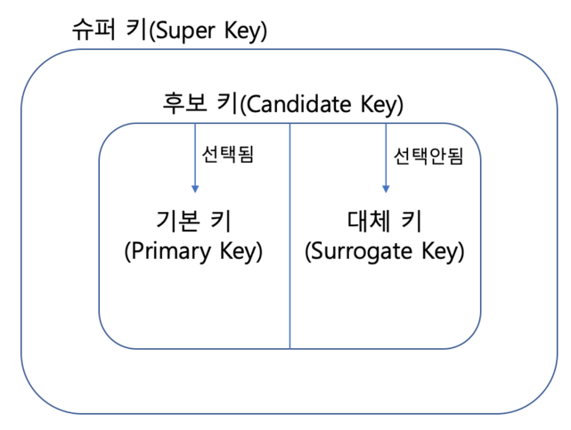

#### 슈퍼키 (Super Key)
- 유일성을 만족하는 속성 또는 속성들의 집합

#### 후보키 (Candidate Key)
- 유일성과 최소성을 만족하는 속성 또는 속성들의 집합

#### 기본키 (Primary Key)
- 후보키에서 선택된 키
- NULL 값 허용 X

#### 대체키 (Surrogate Key)
- 후보키 중 기본키로 선택되지 않은 키

#### 외래키 (Foreign Key)
- 다른 릴레이션의 기본키를 참조하는 속성 또는 속성들의 집합
- 테이블 간 관계를 나타내기 위해 사용
- 외래키 속성과 그것이 참조하는 기본키 속성의 이름은 서로 다를 수 있지만 도메인은 같아야 함
- NULL 값 허용

### 기본키는 수정이 가능한가요?
(기술적으로 불가능하지는 않지만 수정을 권장하지 않는다.

#### PK 수정이 가능한 조건
1. 변경하고자 하는 값을 지닌 PK가 없음
2. 변경하고자 하는 값이 NULL이 아님
3. 해당 PK가 다른 FK로 사용되고 있지 않음

#### PK 수정을 권장하지 않는 이유
1. PK를 수정하게 되면 해당 PK를 FK로 참조하고 있는 다른 행들도 모두 수정해야 함. 수정하지 않을 시 참조 무결성이 깨질 수 있음
2. 기본키는 한 행을 고유하게 식별하는 역할을 하므로 기본키를 수정한다는 건 논리적으로 그 행의 정체성을 바꾸는 것과 같으며, 사실상 새로운 행을 만드는 것과 다름 없음

### 사실 MySQL의 경우, 기본키를 설정하지 않아도 테이블이 만들어집니다. 어떻게 이게 가능한 걸까요?
MySQL의 데이터베이스 엔진인 InnoDB가 다음 우선순위에 따라 알아서 식별자를 결정하기 때문        
> 1. 기본키가 존재할 시 해당 컬럼으로 클러스터형 인덱스 생성
> 2. `UNIQUE NOT NULL`인 인덱스가 존재할 시 해당 인덱스를 클러스터형 인덱스로 사용
> 3. 위 두 조건을 모두 만족하지 않을 시 6바이트 숨겨진 행 ID (row_id)를 자동으로 생성해 사용

#### 클러스터형 인덱스
> 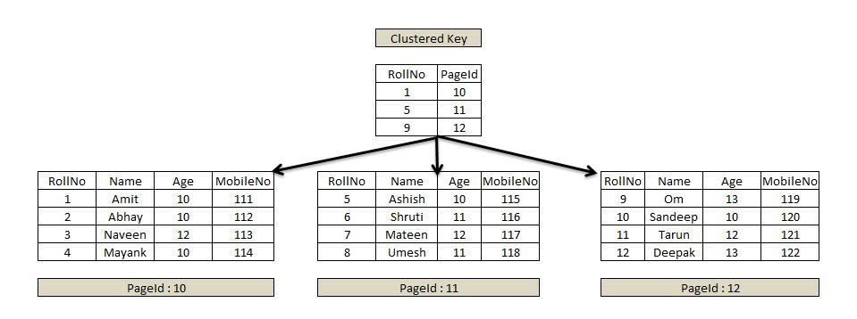
- 특정 열 또는 여러 개의 열들을 기준으로 데이터가 정렬 가능하게 하는 자료구조
- 테이블 자체를 인덱스로 만드는 형태로, 테이블당 하나의 클러스터형 인덱스를 설정 가능
- 레코드의 물리적 순서가 인덱스의 엔트리 순서와 일치하게끔 유지시킴

#### 데이터베이스 엔진 (=스토리지 엔진)
- DBMS가 데이터베이스에 대해 데이터를 삽입, 추출, 업데이트 및 삭제하는 데 사용하는 기본 소프트웨어 컴포넌트
- MySQL에서 테이블을 생성하면 실제로 서버상에는 `.frm`이라는 파일을 생성하는데, 이 파일에 접근하는 속성을 설정하는 것이 스토리지 엔진
- 현대의 많은 DBMS가 동일한 DB 내에 다중 저장 엔진을 지원하며, 저장 엔진은 동일 DB 내의 테이블마다 다르게 지정이 가능
- 역할
  - 트랜잭션 스케줄링
  - 잠금 매니저 → 트랜잭션에 접근하는 데이터베이스 객체에 대한 잠금 제어
  - 액세스 메서드 → 디스크에 저장된 데이터에 대한 접근 및 저장 방식 정의
  - 버퍼 매니저 → 데이터 페이지를 메모리에 캐시
  - 복구 매니저 → 로그 유지 관리 및 장애 발생 시 시스템 복구

### 외래키 값은 NULL이 들어올 수 있나요?
가능하다. 외래키 제약조건의 특성상 외래키의 값은 반드시 부모 테이블의 기본키나 유니크 키 중 하나를 참조해야 하지만,      
값이 없는 상황까지 금지하지는 않는다. 하지만 외래키에 NOT NULL 제약조건이 붙어있다면 불가능하다.

### 어떤 칼럼의 정의에 UNIQUE 키워드가 붙는다고 가정해 봅시다. 이 칼럼을 활용한 쿼리의 성능은 그렇지 않은 것과 비교해서 어떻게 다를까요?
- MySQL에서는 칼럼에 UNIQUE 제약을 걸면 DB는 내부적으로 UNIQUE 인덱스를 생성 → 사실상 인덱스가 수반되어서 조회가 더 빠른 것
- 인덱스가 없을 때는 Full Table Scan(`O(N)`)을 하지만 인덱스가 있을 때에는 B+Tree 탐색(`O(logN)`)을 하므로 조회 성능 향상
- INSERT/UPDATE 시 인덱스 갱신 (B-Tree 갱신) 작업이 필요하며, UNIQUE 인덱스의 경우 중복 체크까지 진행해야 하므로 성능 저하

#### 인덱스 구조 갱신
InnoDB의 인덱스는 모두 B+Tree구조이며 쓰기 시 다음 과정이 추가된다.

> 1. 데이터를 테이블 페이지에 기록
> 2. 인덱스 키를 B+Tree에 삽입 (O(logN))
> 3. 유니크 인덱스인 경우 중복 키 존재 여부 탐색

따라서 인덱스가 많을수록 쓰기 작업 시 I/O가 늘어난다.

## 2. RDB와 NoSQL의 차이에 대해 설명해 주세요.

#### NoSQL

- Not Only SQL : 비관계형 데이터베이스
- 스키마를 미리 정의하지 않아도 데이터를 저장할 수 있는 유연성이 특징
- 키-값 쌍 / 문서 / 그래프 / 열 기반 등 다양한 유형 존재
- 높은 확장성과 가용성
- 실시간 웹 애플리케이션이나 빅데이터를 처리하는 데 널리 사용됨

#### RDBMS 와의 비교
- RDBMS 에서는 정해진 스키마를 따르지 않는다면 데이터를 추가할 수 없지만, NoSQL 에서는 **다른 구조의 데이터를 같은 컬렉션에 추가할 수 있다.**

|  | RDBMS | NoSQL DBMS |
| --- | --- | --- |
| 데이터 구조 | 테이블 형식으로 데이터를 저장 | **고정된 스키마 없이 데이터를 저장**할 수 있으며, 다양한 데이터 모델 저장 가능 |
| 스키마의 유연성 | 미리 정의된 스키마에 따라 데이터를 저장해야 하며 스키마 변경이 복잡 | **스키마 없이도 동적으로 데이터 구조를 변경**할 수 있어 유연하게 대응 |
| 데이터 관계 관리 | 외래 키로 테이블 간의 관계를 관리하며 조인 연산으로 데이터를 연결 | **조인 없이 데이터 중복 저장을 허용**해 높은 성능과 확장성을 제공 |
| 확장성 | 수직적 확장을 통해 성능을 향상 | **수평적 확장을 지원**해 여러 서버에 데이터를 분산시켜 대규모 트래픽을 처리 |

> ##### 수직적 확장 
> - 단일 서버의 성능을 향상시키는 방법. CPU, 메모리, 디스크 등의 하드웨어 자원을 업그레이드하여 처리 능력을 높이는 방식.
> - 데이터가 저장되는 방식 때문에 (스키마에 따라 데이터를 저장해야함) 일반적으로 RDBMS는 수직적 확장만을 지원함
> - 관계가 복잡하고 데이터가 많으면 많을수록 RDB는 수평 확장에 대한 관리가 한없이 복잡해짐
- [ 예시 ] A서버, B서버, C서버가 존재한다고 가정했을 때, A서버에 저장되어있는 1번 게시글 데이터에 대한 3, 4번 댓글 데이터가 각각 B,C 서버에 저장되어 있다면 모든 서버를 뒤져야 원하는 결과를 가져올 수 있다.
> 
> ##### 수평적 확장 
> - 여러 대의 서버를 추가하여 부하를 분산시키는 방법.
> - 빅데이터에서는 수직확장보다 수평확장이 더 좋다.
> - [ 예시 ] 게시글에 속한 댓글 데이터를 해당 게시글과 같은 컬렉션에 넣어주면 됨. NoSQL의 임베드 방식에 따라서 나타나는 특징. → 서버 간 데이터를 찾으러 다닐 필요 없음!
> - 데이터 중복 저장이 가능하므로 쓰기나 갱신 시 일관성을 유지하기 어렵다는 특징 있음
> - `샤딩`: RDBMS 에서 수평 확장을 할 때 사용하는 단어로, 같은 테이블 스키마를 가진 데이터를 다수의 데이터베이스에 분산하여 저장하는 방법을 의미.

#### NoSQL 데이터베이스가 적합한 경우

- 대규모 데이터 처리가 필요한 경우
- 빠른 읽기/쓰기 성능이 필요한 경우 (ex. 캐싱, 실시간 게임, 세션 데이터)
- 스키마가 자주 변경되는 경우
- 데이터 간의 복잡한 관계를 다룰 필요가 없는 경우 (ex. 각 객체가 독립적)
- 고가용성과 분산 시스템, 빠른 확장성 등이 필요한 경우
- 다양한 데이터 모델을 처리해야 하는 경우 (구조적, 반구조적, 비구조적)


### NoSQL의 강점과, 약점이 무엇인가요?
#### NoSQL의 강점
1. 수평 확장성
> - 데이터를 여러 서버에 분산시켜 저장 가능 → 샤딩 구조 지원
> - 트래픽 급증 시 서버를 추가하는 것만으로 확장 가능 → SNS 피드, 실시간 로그, IoT 데이터 수집 등
2. 유연한 스키마
> - 데이터 구조를 사전에 정의할 필요 X → 새로운 필드 추가나 구조 변경이 빠르고 간단
> - JSON, BSON 등 반정형 데이터에 적합
3. 대용량 데이터 처리에 유리
> - 데이터가 매우 많거나 구조가 일정하지 않은 경우에도 성능 저하가 적음
> - 쓰기 중심의 워크로드에서 높은 처리량을 보임
4. 고가용성
> - 대부분 Replication(복제)와 Failover 구조를 지원해 일부 노드 장애에도 서비스 중단 X
> 

#### NoSQL의 약점
1. 일관성 약화
> 분산환경의 CAP 이론(일관성, 가용성, 파티션 허용성의 세 가지 속성을 동시에 완벽히 만족시킬 수 없다)에 따라 대부분 NoSQL은 가용성과 파티션 허용성을 선택하고 즉각적 일관성은 포기 → 결국 `최종적 일관성` 모델  
2. 복잡한 트랜잭션 처리의 어려움
> RDB처럼 ACID 트랜잭션을 완벽히 지원 X → 단일 문서 단위의 원자성만 보장하는 경우 많음
3. 표준화된 쿼리 언어 부재
> SQL처럼 범용적인 질의 언어 X. 각 데이터베이스마다 전용 API나 쿼리 문법을 사용해야 하기 때문에 이식성이 낮고 학습 비용 증가
4. 데이터 중복 및 일관성 관리 부담
> 정규화되지 않은 구조로 인해 동일 데이터가 여러 문서에 복제될 수 있으며 데이터 수정 시 중복된 모든 위치를 갱신해야 하는 문제 존재

### RDB의 어떠한 특징 때문에 NoSQL에 비해 부하가 많이 걸릴 "수" 있을까요? (주의: 무조건 NoSQL이 RDB 보다 빠르다라고 생각하면 큰일 납니다!)
1. 관계형 구조(정규화)로 인한 복잡한 JOIN 연산
> 정규화된 RDB의 경우 여러 테이블을 조인해야 원하는 데이터를 얻을 수 있는 경우가 많은데, 조인은 내부적으로 각 테이블의 인덱스를 탐색하고 조합해야 하므로, 데이터 양이 많거나 인덱스 설계가 미흡하면 디스크 I/O가 급증
2. ACID 트랜잭션 보장으로 인한 동시성 제약
> RDB는 ACID를 보장하는데, 이를 위해 내부적으로 Lock 매커니즘을 사용한다. 다중 트랜잭션이 동시에 같은 데이터를 수정하려 하면 하나는 대기하고 하나는 진행하는 병목 현상이 발생하고, 커밋 시점마다 로그 기록과 데이터 동기화가 수행되어 쓰기 성능 저하를 유발할 수 있음
3. 스키마 제약과 인덱스 유지 비용
> RDB는 고정된 스키마를 사용하므로 새로운 컬럼 추가나 데이터 타입 변경 시 테이블 전체에 영향을 줌. 또한 인덱스는 데이터를 빠르게 읽는 대신 쓰기 시 매번 인덱스 갱신 비용이 발생함
4. 단일 서버 중심의 확장성 한계 (Vertical Scaling)
> 대부분의 전통적 RDB는 수직 확장에 의존하기 때문에 CPU/RAM을 늘려야 처리량이 증가함.

### NoSQL을 활용한 경험이 있나요? 있다면, 왜 RDB를 선택하지 않고 해당 DB를 선택했는지 설명해 주세요.
채팅 데이터 저장을 위해 NoSQL 데이터베이스 중 하나인 MongoDB를 활용한 경험이 있습니다.        
일단 채팅 데이터는 수정/삭제 작업보다 읽기/쓰기 작업이 잦은 대용량 데이터이기 때문에 빠른 성능을 보이는 MongoDB가 더 적합하다고 생각했습니다.        
또한 채팅의 부가 기능으로 메시지 답장, 이모지를 이용한 반응, 파일/사진 첨부 등의 기능들이 있었는데, 채팅 메시지 데이터와 함께 이러한 부가적인 데이터를 함께 조회해야하는 경우가 많았습니다.        
이러한 비정형 데이터를 다루기에는 문서형 데이터베이스인 MongoDB가 적합하다고 판단했습니다.

## 3. 트랜잭션이 무엇이고, ACID 원칙에 대해 설명해 주세요.
#### 트랜잭션
- 데이터베이스에서 논리적으로 하나의 작업 단위로 묶인 연산들의 집합
- 트랜잭션 내 SQL문들은 모두 성공하는 경우 커밋되고, 도중에 오류가 나면 롤백되어 이전 상태로 복구된다.

#### ACID 원칙
- 트랜잭션이 신뢰성 있게 수행되기 위해 보장해야 하는 4가지 속성

| 속성                  |설명|
|---------------------|---|
| A (Atomicity, 원자성)  | 트랜잭션의 모든 연산은 모두 수행되거나, 전혀 수행되지 않아야 함|
| C (Consistency, 일관성) | 트랜잭션 수행 전후로 DB의 무결성이 유지되어야 함|
| I (Isolation, 격리성)  | 동시에 여러 트랜잭션이 실행되어도 서로의 작업에 영향을 주지 않아야 함|
| D (Durability, 영속성) | 트랜잭션이 성공적으로 완료되면 그 결과는 영구적으로 저장되어야 함|

### ACID 원칙 중, Durability를 DBMS는 어떻게 보장하나요?
트랜잭션 커밋 시 변경 내용을 먼저 WAL에 기록하고, 로그를 디스크에 동기화한 후에만 커밋을 완료시킨다.    
장애 발생 시 해당 로그를 이용해 커밋된 트랜잭션을 복구함으로써 durability를 보장한다.

#### 메커니즘
1. Write-Ahead Logging (WAL) : 대부분의 DBMS는 WAL (쓰기 선행 구조) 방식 사용       
> ##### 원리
> 1. 트랜잭션 수행 중 변경사항을 데이터 파일에 직접 반영하기 전, 먼저 로그파일 (redo log / WAL)에 기록
> 2. 이 로그가 디스크에 안전하게 기록 (fsync) 되면 커밋 완료 신호 반환
> 3. 이후 실제 데이터 파일은 백그라운드에서 비동기적으로 갱신됨 → 데이터보다 로그를 먼저 기록하고, 장애 시 로그를 이용해 복구
2. Redo / Undo Log 구조
> ##### Redo Log
> 커밋된 변경 내용을 다시 적용할 수 있도록 기록 (복구 시 사용)
> ##### Undo Log
> 롤백을 위해 트랜잭션 이전 상태를 저장
3. Checkpoint
> - 주기적으로 DB의 버퍼 풀 내용을 디스크에 반영하는 작업    
> - 체크포인트를 통해 디스크와 로그의 차이를 줄이고, 장애 복구시간을 단축함 → 체크포인트 이후 로그만 재적용하면 된다는 구조를 만드는 것
4. 스토리지 / 파일시스템 동기화 (fsync)
> DBMS는 커밋 시점에 OS 캐시에만 쓰는 게 아니라 `fsync()` 호출로 디스크까지 실제로 기록되었는지 확인

### 트랜잭션을 사용해 본 경험이 있나요? 어떤 경우에 사용할 수 있나요?
다중 테이블에 insert/update 하는 작업이 하나의 논리적 작업 단위일 때 사용합니다.     
예를 들어 회원가입 기능을 구현할 떄, 회원 테이블에 사용자 정보를 추가하고, 권한 테이블에 기본 권한을 등록하고,    
관계 테이블에 초기 정보를 저장해야하는 일이 있었습니다. 이 중 하나라도 실패할 경우 전체 데이터를 되돌려야 하므로     
`@Transactional` 어노테이션을 사용해 원자성을 보장했습니다.       
또한 사용자가 게시글을 작성하면서 첨부파일을 동시에 업로드할 때, 게시글은 DB에 저장하고 파일은 S3에 업로드해야 했습니다.    
파일 업로드 중 오류가 발생할 경우 게시글도 저장되면 안 되므로, DB 저장 로직을 트랜잭션으로 감싸 롤백시키도록 구현하여     
DB와 외부 리소스 간의 상태 불일치를 방지한 경험이 있습니다. 

### 읽기에는 트랜잭션을 걸지 않아도 될까요?
- 단순한 조회만 한다면 트랜잭션을 꼭 걸 필요는 없으나 **일관된 데이터 읽기**가 필요하다면 트랜잭션 필요
- 트랜잭션을 걸어야 하는 경우
  - 여러 번의 조회가 논리적으로 하나의 작업 단위로 간주될 때 (예: 첫번째 SELECT의 결과를 기반으로 두번째 UPDATE를 수행할 때)
  - 동일한 시점의 데이터 일관성을 보장해야 할 때
  - 격리 수준을 높여 Dirty Read / Non-repeatable Read / Phantom Read 를 방지해야 할 때

#### 읽기 일관성이 보장되지 않는 경우
```sql
SELECT balance FROM account WHERE id = 1; -- 10,000원
-- 그 사이 다른 트랜잭션이 업데이트 수행
UPDATE account SET balance = 0 WHERE id = 1;
SELECT balance FROM account WHERE id = 1; -- 0원
```

#### 읽기 일관성이 보장되는 경우 → Consistent Snapshot Read (일관된 스냅샷 읽기)
```sql
START TRANSACTION;
SELECT balance FROM account WHERE id = 1; -- 10,000원
-- 다른 트랜잭션이 업데이트해도
SELECT balance FROM account WHERE id = 1; -- 여전히 10,000원
COMMIT;
```

## 4. 트랜잭션 격리 레벨에 대해 설명해 주세요.
> 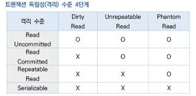

트랜잭션의 격리 수준(Isolation Level)은 동시에 여러 트랜잭션이 수행될 때, 각 트랜잭션 간의 데이터 접근을 얼마나 독립적으로 보장할 것인지를 정의한 것이다.      
트랜잭션 격리 수준은 SQL 표준에서 4단계로 정의되어 있으며, 아래로 갈수록 격리 수준이 높아지되 성능(동시성)은 낮아진다.

| 격리 수준            |설명|발생 가능 문제|
|------------------|--|-----------|
| READ UNCOMMITTED | 커밋되지 않은 데이터를 다른 트랜잭션이 읽을 수 있음 | Dirty Read / Non-Repeatable Read / Phantom Read |
| READ COMMITTED   | 커밋된 데이터만 읽을 수 있음 (대부분의 DBMS 기본값) | Non-Repeatable Read / Phantom Read |
| REPEATABLE READ  | 트랜잭션 내에서 같은 쿼리 결과가 항상 동일 | Phantom Read |
| SERIALIZABLE     | 모든 트랜잭션을 순차적으로 수행한 것과 동일하게 보장 | 거의 없음 |

#### 1. READ UNCOMMITTED
> 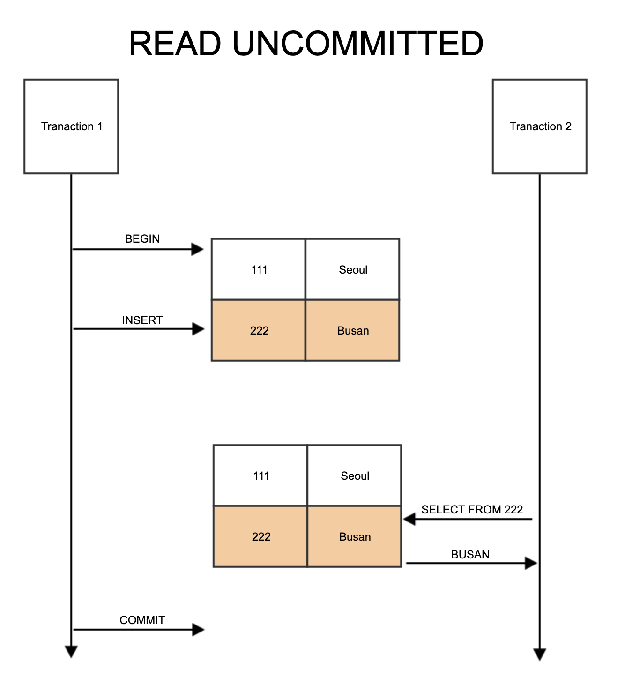
- 어떤 트랜잭션의 변경 내용이 Commit이나 Rollback과 상관없이 다른 트랜잭션에서 보여짐
- 문제 예시 (Dirty Read) 
  - A 트랜잭션이 `balance = 100` → `balance = 50` 으로 변경 후 아직 커밋하지 않은 상태
  - B 트랜잭션이 `balance` 값을 읽으면 50으로 보이지만, 나중에 A가 롤백하면 B는 잘못된 데이터를 본 셈이 됨

#### 2. READ COMMITTED
> 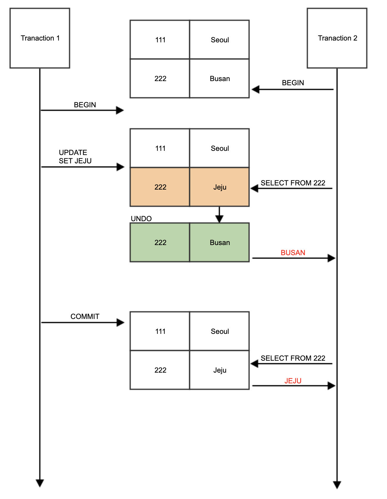
- 어떤 트랜잭션의 변경 내용이 Commit 되어야만 다른 트랜잭션에서 조회 가능
- 대부분의 상용 DBMS의 기본 수준
- 실제 테이블 값을 가져오는 게 아니라 Undo 영역에 백업된 레코드에서 값을 조회하게 됨
- 문제 예시 (Non-Repeatable Read)
  - A 트랜잭션이 account 테이블에서 id가 1인 레코드의 balance 값을 조회 
  - B 트랜잭션이 account 테이블의 id가 1인 레코드의 balanace 값을 변경 후 커밋
  - A 트랜잭션에서 같은 쿼리를 다시 실행했을 때 결과가 이전과 다르게 나옴 (한 트랜잭션에서 같은 쿼리를 두 번 실행했을 때, 그 결과가 다르게 나오는 Non-repeatable 현상 발생)

#### 3. REPEATABLE READ
> 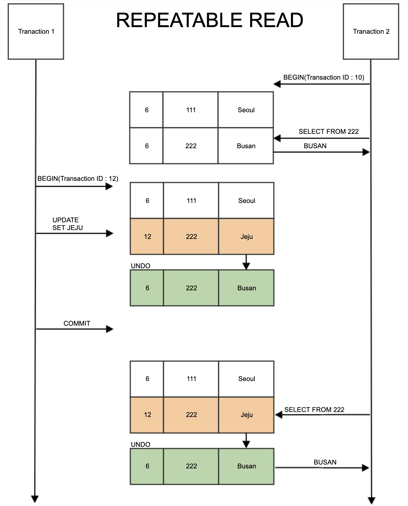
- 트랜잭션이 시작되기 전 커밋된 내용에 대해서만 조회 가능
- 트랜잭션이 시작된 시점의 데이터를 "스냅샷"으로 유지 (MVCC; Multi Version Concurrency Control 기반 DB)
  - 트랜잭션마다 트랜잭션 ID를 부여하여 트랜잭션 ID보다 작은 트랜잭션 번호에서 변경한 것만 읽게 된다. 
- MySQL(InnoDB)의 기본 격리 수준
  - 문제 예시 (Phantom Read)
  ```sql
    START TRANSACTION; -- transaction id : 1
    SELECT * FROM Member; -- 0건 조회
  
        START TRANSACTION; -- transaction id : 2
        INSERT INTO MEMBER VALUES(1,'joont',28);
        COMMIT;
  
    SELECT * FROM Member; -- 여전히 0건 조회
    UPDATE Member SET name = 'zion.t' WHERE id = 1; -- 1 row(s) affected
    SELECT * FROM Member; -- 1건 조회
    COMMIT;
  ```
  - A 트랜잭션이 where 조건으로 age > 20인 사람을 조회했을 때 3이라는 결과를 얻음
  - B 트랜잭션이 age = 25인 사람을 새롭게 삽입 후 커밋
  - A가 이전과 같은 쿼리를 다시 실행했을 때 4라는 결과를 얻음 (새로운 phantom 행 등장)

#### 4. SERIALIZABLE
- 가장 단순하고 엄격한 격리 수준이지만 성능 저하가 심함 
- InnoDB에서 기본적으로 순수한 SELECT 작업에는 아무런 잠금을 걸지 않고 동작하지만, 격리 수준이 SERIALIZABLE일 경우 읽기 작업에도 공유 잠금을 설정하고, 동시에 다른 트랜잭션에서 해당 레코드를 변경하지 못하게 됨


### 모든 DBMS가 4개의 레벨을 모두 구현하고 있나요? 그렇지 않다면 그 이유는 무엇일까요?
- 모든 DBMS가 4가지 트랜잭션 격리 레벨을 모두 구현하고 있지는 않음
- 표준 그대로 구현하지 않는 이유
  - Oracle, PostgreSQL, MySQL 등은 MVCC를 사용하는데, MVCC는 Undo 로그를 통해 과거 버전을 읽게 하므로 Dirty Read가 원천적으로 차단되고, READ UNCOMMITTED는 사실상 READ COMMITTED처럼 동작한다. 또한 MVCC가 트랜잭션 시작 시점의 버전을 유지하므로 REPEATABLE READ에서는 팬텀 리드까지 거의 방지돼 SERIALIZABLE에 가까워진다. 
  - SERIALIZABLE 수준은 트랜잭션 간 순서를 완전히 보장해야 하므로 락 충돌이 잦고 성능이 급격히 저하된다. 대부분 실무 환경에서는 READ COMMITTED 또는 REPEATABLE READ이면 충분하므로 불필요한 레벨의 구현은 생략하거나 단순화한다.

### 만약 MySQL을 사용하고 있다면, (InnoDB 기준) Undo 영역과 Redo 영역에 대해 설명해 주세요.

#### Undo 영역
- 데이터 변경시 변경 이전 데이터를 기록하는 데에 사용되는 로그
- 트랜잭션의 롤백 지원
  > 트랜잭션이 실행중 실패하거나 사용자가 롤백을 요청한 경우 UndoLog에 저장된 데이터를 이용해 트랜잭션 이전상태로 데이터를 복구
- MVCC 지원
  > 트랜잭션이 변경하기 전의 데이터 버전이 Undo Log에 기록되니 다른 트랜잭션에서 이 버전을 참조해 일관성있게 데이터를 읽을 수 있게 함
- 동작 과정 | `UPDATE account SET balance = 500 WHERE id = 1;` 수행 시
  > 1. 실제 데이터를 바꾸기 전 이전 값 (balance = 100)을 Undo Log에 기록
  > 2. 새 값(500)을 버퍼 풀에 반영
  > 3. 트랜잭션이 커밋되면 Undo Log는 더이상 필요 없음으로 표시됨 (즉시 삭제하지는 않고, 다른 트랜잭션이 해당 Undo 버전을 참조하지 않게 되면 Purge Thread가 실제로 삭제)
  > 4. 트랜잭션이 롤백되면 Undo Log를 사용해 이전 값으로 복구함

#### Redo 영역
- 데이터 변경 시 변경 이후 결과를 저장하는 데 사용되는 로그
- InnoDB는 성능을 위해 데이터를 디스크에 즉시 쓰지 않고 버퍼 풀에 먼저 기록하는데, 이 버퍼는 휘발성 메모리이기 때문에 서버가 갑자기 꺼지면 메모리 내용이 사라짐 → Redo Log를 사용해 이미 커밋된 트랜잭션을 복구
- 빠른 로그 기록으로 안전하게 커밋을 보장한 뒤 나중에 실제 데이터 파일을 디스크에 업데이트한다는 의도
  > Redo Log 파일은 연속된 공간에 데이터를 차례로 쓰는 순차 I/O이기 때문에 속도가 빠르고, 실제 데이터 파일을 업데이트 시키는 작업은 변경되는 페이지가 디스크의 여러 곳에 흩어져있는 랜덤 I/O 작업이기 때문에 속도가 느림
- 동작 과정
  > 1. 데이터가 변경될 때 어떤 페이지의 어떤 내용이 어떻게 바뀌었는지를 Redo Log에 기록
  > 2. 트랜잭션이 커밋될 때 Redo Log를 디스크에 먼저 기록 (fsync)
  > 3. 나중에 DB가 재시작되면 Redo Log를 이용해 "커밋되었지만 아직 디스크에 반영되지 않은 변경"을 재적용

### 그런데, 스토리지 엔진이 정확히 무엇을 하는 건가요?

#### 데이터베이스 엔진 (=스토리지 엔진)
- DBMS가 데이터베이스에 대해 데이터를 삽입, 추출, 업데이트 및 삭제하는 데 사용하는 기본 소프트웨어 컴포넌트/모듈
- MySQL에서 테이블을 생성하면 실제로 서버상에는 `.frm`이라는 파일을 생성하는데, 이 파일에 접근하는 속성을 설정하는 것이 스토리지 엔진
- MySQL에서 SQL 쿼리를 실행할 때 어떻게 데이터를 디스크에 저장하고, 어떻게 인덱스를 관리하며, 어떻게 트랜잭션을 처리할지를 결정하는 저수준 구현 계층
- 현대의 많은 DBMS가 동일한 DB 내에 다중 저장 엔진을 지원하며, 저장 엔진은 동일 DB 내의 테이블마다 다르게 지정이 가능
- 역할
  - 트랜잭션 스케줄링
  - 잠금 매니저 → 트랜잭션에 접근하는 데이터베이스 객체에 대한 잠금 제어
  - 액세스 메서드 → 디스크에 저장된 데이터에 대한 접근 및 저장 방식 정의
  - 버퍼 매니저 → 데이터 페이지를 메모리에 캐시
  - 복구 매니저 → 로그 유지 관리 및 장애 발생 시 시스템 복구

#### MySQL의 구조
```
[ MySQL Server Layer ] -- SQL을 해석하고 실행 계획을 세움 (결정)
   ├─ SQL Parser / Optimizer (SQL 파싱 및 실행 계획)
   ├─ Query Cache, Connection, Security
   └─ (여기서 스토리지 엔진 호출)

[ Storage Engine Layer ] -- 데이터를 실제로 저장/수정/조회 (수행)
   ├─ InnoDB
   ├─ MyISAM
   ├─ Memory
   ├─ CSV, Archive, NDB, ...
```

## 5. 인덱스가 무엇이고, 언제 사용하는지 설명해 주세요.
- 데이터베이스에서 검색 속도를 높이기 위해 사용하는 자료 구조
- 테이블 전체를 일일이 탐색하는 full table scan을 하지 않고 원하는 행이 저장된 위치를 바로 찾아갈 수 있도록 도와줌
- MySQL(InnoDB 기준)에서는 주로 B+Tree 구조로 인덱스를 구현 → 평균 탐색 복잡도 O(logN)
- 인덱스를 주로 사용하는 효과적인 상황
  - WHERE 조건에서 해당 칼럼을 이용해 자주 검색할 때
  - JOIN, ORDER BY, GROUP BY에 자주 사용되는 칼럼일 때
  - 데이터가 많고 검색 조건이 특정 범위만 걸릴 때

### 일반적으로 인덱스는 수정이 잦은 테이블에선 사용하지 않기를 권합니다. 왜 그럴까요?
- MySQL 기준 인덱스는 B+Tree 구조로 저장되며, 즉 인덱스는 항상 정렬 상태를 유지해야 한다. 따라서 삽입/수정/삭제 작업이 수행될 때마다 인덱스 트리를 재정렬하는 추가 비용이 발생함
- 인덱스가 많은 테이블의 경우 한 번의 변경이 여러 번의 쓰기 작업으로 이루어짐 → 한 번의 UPDATE가 실제로는 데이터 파일 + 여러 인덱스 파일의 동시 수정으로 이어짐

### 앞 꼬리질문에 대해, 그렇다면 인덱스에서 사용하지 않겠다고 선택한 값은 위 정책을 그대로 따라가나요?
- 인덱스를 사용하지 않는다 = 해당 컬럼에 대해 별도의 탐색용 B+Tree를 만들지 않는다 → 해당 컬럼에 대한 추가적인 인덱스 트리 유지 작업만 없을 뿐
- 인덱스를 사용하지 않아도 InnoDB의 공통 메커니즘인 Undo/Redo 로그, 버퍼 풀, 페이지 단위 I/O 작업은 동일하게 적용된다.

### ORDER BY/GROUP BY 연산의 동작 과정을 인덱스의 존재여부와 연관지어서 설명해 주세요.
- 두 연산 모두 정렬이 핵심 과정 → 데이터가 이미 정렬되어 있으면 빠르고, 정렬되어 있지 않다면 정렬하거나 임시 테이블을 생성하는 등의 추가 비용 발생
  - `ORDER BY` : 데이터를 정렬된 순서로 반환하는 연산
  - `GROUP BY` : 데이터를 같은 값끼리 묶어서 집계하는 연산
- 만약 인덱스가 있더라도 순서가 불일치할 경우 filesort 과정이 발생함
  > ```sql
  > CREATE INDEX idx_user_name_age ON user (name, age);
  > SELECT * FROM user ORDER BY age;     -- ❌ 인덱스 순서 불일치
  > SELECT * FROM user ORDER BY name;    -- ✅ 인덱스 선두 컬럼만 사용
  > SELECT * FROM user ORDER BY name, age; -- ✅ 완전히 일치
  > ```

#### 인덱스가 있을 때 `ORDER BY`의 동작 과정
```sql
CREATE INDEX idx_user_age ON user (age);

SELECT * FROM user ORDER BY age ASC;
```
- 인덱스 idx_user_age는 이미 age 순서로 정렬되어 있고, MySQL은 인덱스 순서대로 데이터를 읽기만 하면 되므로 별도의 정렬 연산 필요 X
- filesort 단계 생략 → 속도 빠름

#### 인덱스가 있을 때 `GROUP BY`의 동작 과정
```sql
CREATE INDEX idx_dept_salary ON employee (dept_id, salary);

SELECT dept_id, COUNT(*) FROM employee GROUP BY dept_id;
```
- 인덱스의 선두 컬럼(dept_id)이 정렬되어 있으므로 같은 dept_id 값들이 인덱스 상에서 연속해서 저장됨
- DB는 인덱스를 순서대로 스캔하면서 같은 그룹이 끝날 때마다 집계를 수행할 수 있음 
- 별도의 정렬 없이 GROUP BY 처리 가능 

### 기본키는 인덱스라고 할 수 있을까요? 그렇지 않다면, 인덱스와 기본키는 어떤 차이가 있나요?
- 기본키는 인덱스의 한 종류이지만, 인덱스 ≠ 기본키
- MySQL(InnoDB)는 기본키를 자동으로 클러스터형 인덱스로 생성함
  - 클러스터 인덱스 : 실제 데이터가 인덱스 리프 노드에 함께 저장됨
  - 보조 인덱스 : 리프 노드에 실제 데이터 대신 "기본키 값"을 저장, PK를 통해 실제 데이터 접근

|구분|기본키|인덱스|
|---|----|-----|
|의미|테이블 내 행을 유일하게 식별하는 제약조건|데이터 검색 속도를 높이기 위한 자료구조|
|개수|한 테이블당 1개만 존재 가능|여러 개 생성 가능|
|NULL 허용 여부|불가|가능|
|중복 허용 여부|불가|가능 (UNIQUE INDEX 제외)|
|InnoDB에서의 형태|클러스터 인덱스|보조 인덱스|
|목적|무결성 보장|성능 향상|

### 그렇다면 외래키는요?
- 외래키는 두 테이블 간 참조 무결성을 보장하기 위한 제약조건으로, 다른 테이블의 기본키나 유니크 키를 참조
- 외래키 자체가 인덱스는 아니지만, 참조 무결성 검사를 빠르게 수행하기 위해 부모 테이블은 PK/UNIQUE 인덱스가 필요하고, 자식 테이블에는 외래키 컬럼에 자동으로 인덱스가 생성됨
- 부모 테이블/자식 테이블 인덱스 활용
  - 자식 테이블에 새로운 데이터를 `INSERT`할 시 부모 테이블에 해당 키가 있는지 확인해야 함 → 부모 테이블 인덱스로 빠른 검색
  - 부모 테이블의 행을 `DELETE`할 시 자식 테이블에 참조 중인 행이 있는지 확인해야 함 → 자식 테이블 인덱스로 빠른 검색

### 인덱스가 데이터의 물리적 저장에도 영향을 미치나요? 그렇지 않다면, 데이터는 어떤 순서로 물리적으로 저장되나요?
- 인덱스가 데이터의 물리적 저장 순서에 영향을 미치는 경우도 존재하고, 아닌 경우도 존재
- 클러스터형 인덱스의 경우, InnoDB에서는 테이블의 기본키가 곧 클러스터 인덱스이므로 **데이터 자체가 기본키 순서로 정렬되어 저장**됨
  - 클러스터형 인덱스는 B+Tree 에 정렬되어 저장되고, 리프노드에 실제 행 전체가 저장되기 때문
- 보조 인덱스의 경우 별도의 B+Tree로 존재하고, 리프 노드에는 실제 데이터가 아니라 기본키 값이 저장됨 → 데이터의 저장 순서와 무관

### 우리가 아는 RDB가 아닌 NoSQL (ex. Redis, MongoDB 등)는 인덱스를 갖고 있나요? 만약 있다면, RDB의 인덱스와는 어떤 차이가 있을까요? 
- RDB의 경우 기본적으로 B+Tree 구조를 사용하지만, NoSQL의 경우 엔진 별로 상이 (각 데이터 모델에 맞도록 해시, B-Tree, Bloom Filter 등 다양한 구조 사용)
- RDB는 정렬/범위 검색을 지원하지만 NoSQL은 유형에 따라 다름 (Redis는 지원하지 않지만, MongoDB는 지원)

#### Redis의 인덱스
- 모든 Key는 해시 테이블 구조로 관리되므로 Key 자체가 인덱스 역할을 함
- O(1) 수준으로 탐색이 가능하며, 대신 Value 내용에 대한 인덱스는 지원 X

#### MongoDB의 인덱스
- JSON(Document) 구조의 필드에 대해 인덱스 생성 가능
- 내부적으로 B-Tree 기반 인덱스 사용
- 기본적으로 _id 필드에 자동 인덱스 생성 (RDB의 PK와 유사)
- 복합 인덱스, 다중 필드 인덱스, 텍스트/지리공간 인덱스 등도 지원

### (A, B) 와 같은 방식으로 인덱스를 설정한 테이블에서, A 조건 없이 B 조건만 사용하여 쿼리를 요청했습니다. 해당 쿼리는 인덱스를 탈까요? 
- 복합 인덱스를 제어하는 기본 원칙은 "가장 왼쪽 접두사 규칙"으로, (A,B,C) 와 같은 인덱스가 있다면 다음을 효율적으로 검색하는 데 사용 가능
  - A
  - (A,B)
  - (A,B,C)
- 인덱스가 저장된 구조인 B+Tree는 항상 A → B 순으로 정렬되어 있음. 즉, 트리 탐색 시 A 값이 먼저 고정되어야 B의 위치를 찾을 수 있기 때문에 B 조건만 사용하여 쿼리를 요청할 경우 인덱스를 타지 않음

## 6. RDBMS, NoSQL에서의 클러스터링/레플리케이션 방식에 대해 설명해 주세요.

#### 클러스터링
> 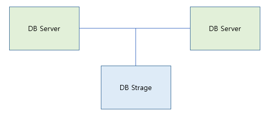
- 여러 개의 DB 서버를 수평적인 구조로 구축하는 방식
- 여러 개의 DB 서버가 하나의 스토리지를 공유하거나 데이터를 실시간 동기화하면서 하나의 논리적 DB처럼 동작하는 구조
- 분산 환경을 구성하여 단일 장애 지점을 제거하고 고가용성을 확보하는 Fail Over 시스템을 구축하기 위해 사용
- **동기 방식**으로 데이터를 동기화함
- `Active-Active` 방식과 `Active-StandBy` 방식 존재
  - `Active-Active` 방식
    > 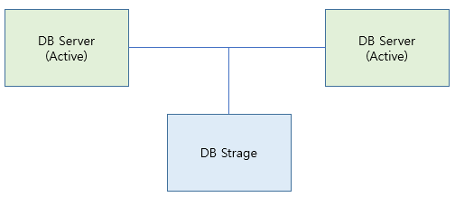
    > 서버 하나가 죽어도 다른 서버가 바로 역할을 수행 가능하므로 무중단 서비스가 가능하며, 같이 사용되어 CPU와 메모리 이용률을 늘릴 수 있음.                
    > 저장소 하나를 공유하면 병목현상이 발생한다는 단점과 비용 문제 존재
  - `Active-StandBy` 방식
    > 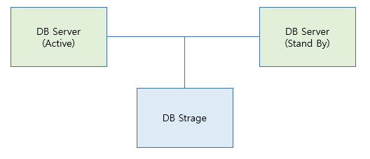
    > 운영 중인 서버가 정지될 경우 StandBy 중인 서버를 Active 상태로 전환.       
    > Active-Active 방식에 비해 비용이 적게 들지만 서버 상태를 전환하는 데 시간이 든다는 단점 존재

#### 레플리케이션
> 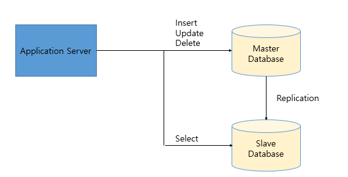
- 여러 개의 DB를 권한에 따라 수직적인 구조(Master-Slave)로 구축하는 방식
  - Master 노드에서는 쓰기 작업만을 처리하며 Slave 노드에서는 읽기 작업만 수행
- 스토리지까지 복제함으로써 데이터의 유실을 최소화
- 데이터 복제, 읽기 부하 분산, 백업 등이 목적
- **비동기 방식**으로 데이터를 동기화하기 때문에 일관성 있는 데이터를 얻지 못할 수 있음

#### RDBMS에서의 클러스터링/레플리케이션

##### 클러스터링
> 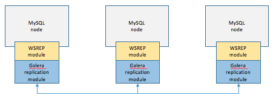
> 1. 한 개의 노드에 쓰기 트랜잭션이 수행되고, 커밋 실행
> 2. 실제 디스크에 내용을 쓰기 전 다른 노드로 데이터 복제를 요청
> 3. 다른 노드에서 복제 요청을 수락했다는 신호를 보내고, 디스크에 쓰기를 시작
> 4. 다른 노드로부터 신호를 받으면 실제 디스크에 데이터 저장
  - 항상 일관성 있는 데이터를 얻을 수 있음
  - 1개의 노드가 죽어도 다른 노드가 살아있어 시스템을 계속 장애 없이 운영 가능 (Active-Active)
  - 여러 노드들 간 데이터를 동기화하는 시간이 필요하므로 replication에 비해 성능 떨어짐
  - 장애가 전파된 경우 처리가 까다롭고 데이터 동기화에 의해 스케일링에 한계가 있음

##### 레플리케이션
> 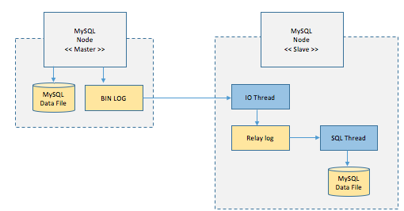
> 1. Master 노드에 쓰기 트랜잭션 수행
> 2. Master 노드는 데이터를 저장하고 트랜잭션에 대한 로그를 파일에 기록
> 3. Slave 노드의 IO Thread는 Master 노드의 로그 파일(`BIN LOG`)을 파일(`Replay Log`)에 복사
> 4. Slave 노드의 SQL Thread는 Replay Log 파일을 한 줄씩 읽으며 데이터 저장
  - DB 요청의 6-80%가 읽기 작업이라는 점을 고려했을 때 Replication 방식만으로 성능이 충분히 향상됨
  - 비동기 방식으로 데이터를 동기화하기 때문에 지연 시간 단축
  - 노드들 간 데이터 동기화가 보장되지 않아 일관성 있는 데이터를 얻을 거란 보장 X
  - Master 노드가 다운될 경우 복구 및 대처가 까다로움

#### NoSQL에서의 클러스터링/레플리케이션
- Cassandra나 Redis 같은 NoSQL의 경우 클러스터링과 레플리케이션이 자동으로 통합되어 작동

##### 클러스터링
- 데이터를 여러 노드에 분산(샤딩)시켜 수평 확장을 달성하는 구조
- 각 샤드는 전체 데이터의 일부만 가지며, MongoDB의 경우 mongos 라우터가 클라이언트 요청을 적절한 샤드로 보냄

##### 레플리케이션
- 데이터를 여러 노드에 복제해 장애 복구와 가용성을 높이는 구조

### 이러한 분산 환경에선, 트랜잭션을 어떻게 관리할 수 있을까요?
- 분산환경에서는 여러 노드에 걸친 트랜잭션을 관리해야 하기 때문에 단일 DB처럼 ACID 특성을 그대로 유지하기 어려움
- 분산 트랜잭션을 관리하는 방안으로 크게 두 가지 패턴 존재
  > 
  - 2Phase Commit 패턴
  - Saga 패턴

#### 2Phase Commit 패턴
- 분산 시스템에서 트랜잭션의 원자성을 보장하기 위해 사용되는 분산 트랜잭션 관리 기법.
- 전통적인 방식으로 XA 트랜잭션이라고도 부름
- 주로 여러 데이터베이스나 시스템이 참여하는 트랜잭션에서 모든 참여자가 성공적으로 트랜잭션을 완료하거나 모두 취소하도록 조정하는 데 사용
- 두 단계로 구성되며 코디네이터와 여러 참여자 간 통신을 통해 동작함
  - `Coordinator` : 트랜잭션을 관리하고 전체 프로세스를 조정하는 역할
  - `Participants` : 트랜잭션에 참여하는 각 데이터베이스나 시스템. 각 참여자는 트랜잭션의 일부분을 처리
- 동작 방식
  - [1단계] 준비(Prepare) 단계
    > 1. 클라이언트가 트랜잭션을 시작하면 코디네이터가 트랜잭션을 관리하기 시작
    > 2. 코디네이터는 모든 참여자에게 Prepare 메시지를 보냄. 이 메시지는 트랜잭션을 커밋할 준비가 되었는지 확인하기 위한 것
    > 3. 각 참여자는 로컬 트랜잭션을 준비하고, 트랜잭션 준비가 되면 Prepared 메시지를 코디네이터에게 반환. 만약 문제가 발생해 트랜잭션을 커밋할 수 없으면 Abort 메시지 
  - [2단계] 커밋 또는 중단(Commit or Abort) 단계
    > 1. 코디네이터는 모든 참여자로부터 Prepared 메시지를 받으면 트랜잭션을 커밋하기로 결정. 하나라도 Abort 메시지를 받으면 트랜잭션을 중단하기로 결정
    > 2. 코디네이터는 모든 참여자에게 Commit 또는 Abort 메시지를 보냄
    > 3. 참여자들은 받은 메시지에 따라 트랜잭션을 최종적으로 커밋하거나 롤백함. 이후 완료 메시지를 코디네이터에게 보냄
- 모든 참여자가 트랜잭션을 일관되게 커밋하거나 중단하도록 보장하여 원자성 유지 (+)
- 블로킹; 코디네이터나 참여자가 실패할 경우 다른 참여자들이 오랫동안 대기 상태에 머물 수 있음 (-)
- SPOF; 코디네이터가 실패하면 전체 트랜잭션이 중단되거나 복구가 어려울 수 있음 (-)
- 모든 참여자 간의 통신이 필요하므로 네트워크 지연이나 오버헤드가 발생할 수 있음 (-)
- 참여자 수가 많아질수록 관리가 복잡해지고 성능이 저하될 수 있음 (-)
- 대안 : 2PC의 블로킹 문제를 개선한 3PC, 트랜잭션을 미리 시도해보고 성공하거나 실패 시 결정하는 TCC, 합의 알고리즘을 사용해 트랜잭션의 일관성을 유지하는 분산 합의 알고리즘 등

#### Saga 패턴
> 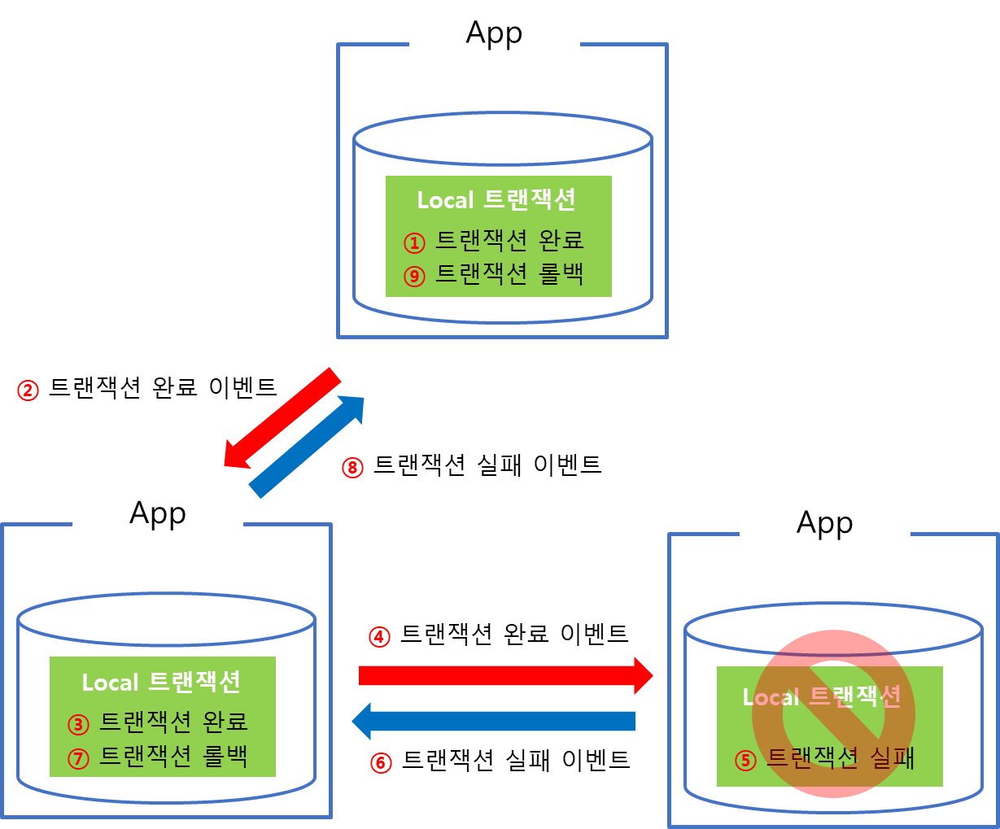
- MSA에서 가장 널리 쓰이는 분산 트랜잭션 관리 패턴
- 마이크로서비스들끼리 이벤트를 주고받아 특정 마이크로서비스에서의 작업이 실패하면 이전까지의 작업이 완료된 마이크로서비스들에게 보상 이벤트를 소싱함으로써 분산 환경에서 원자성을 보장하는 패턴
- 트랜잭션의 관리 주체가 DBMS에 있는 것이 아니라 어플리케이션에 있는 것이 핵심. 각 어플리케이션 하위에 존재하는 DB는 로컬 트랜잭션만 담당하며 각 어플리케이션의 트랜잭션 요청의 실패로 인한 롤백 처리(=보상 트랜잭션)은 어플리케이션에서 구현
- SAGA 패턴은 크게 두가지로 나뉨
  - `Choreography based SAGA Pattern`
    > 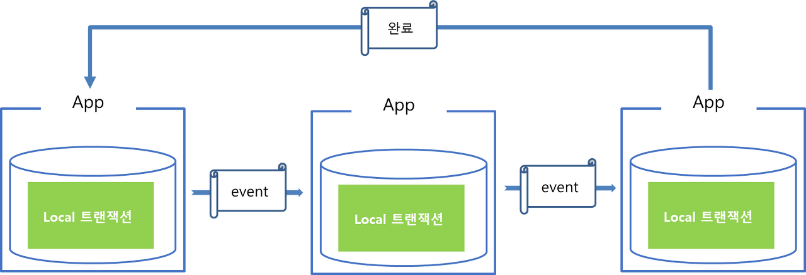
    > 보유한 서비스 내의 로컬 트랜잭션을 관리하며 트랜잭션이 종료하게 되면 완료 이벤트 발행. 만약 그 다음 수행해야 할 트랜잭션이 있으면 해당 트랜잭션을 수행해야 하는 어플리케이션으로 이벤트를 보내고, 해당 어플리케이션은 완료 이벤트를 수신받고 다음 작업을 진행함.      
    > 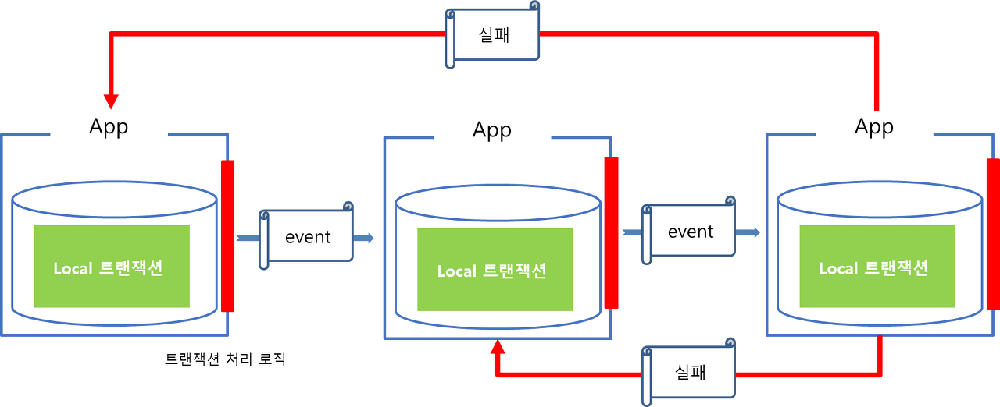
    > 만약 중간에 트랜잭션이 실패하면, 해당 트랜잭션 처리를 실패한 어플리케이션에서 보상 이벤트를 발행해 롤백 처리 시도
  - `Orchestration based SAGA Pattern`
    > 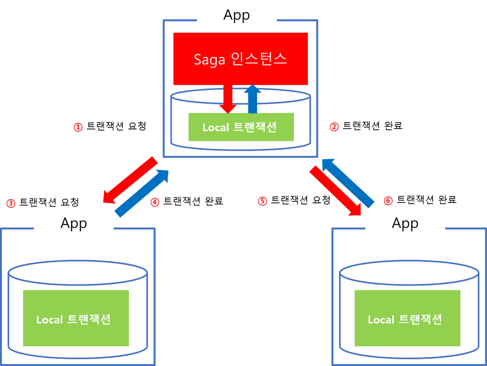
    > 트랜잭션 처리를 위해 Saga 인스턴스(=Manager)가 별도로 존재. 트랜잭션에 관여하는 모든 어플리케이션은 매니저에 의해 점진적으로 트랜잭션을 수행하며 결과를 매니저에게 전달함. 비즈니스 로직상 마지막 트랜잭션이 끝나면 매니저를 종료해서 전체 트랜잭션 처리를 종료함. 만약 중간에 실패할 경우 매니저에서 보상 트랜잭션을 발동하여 일관성 유지.            
    > 모든 관리를 매니저가 호출하기 때문에 분산트랜잭션의 중앙 집중화가 이루어지며, 롤백이 쉬워짐
    
### 마스터, 슬레이브 데이터 동기화 전 까지의 데이터 정합성을 지키는 방법은 무엇이 있을까요?

#### 반동기 복제방식 (Semi-Sync Replication) → 복제 보장
- 마스터가 트랜잭션 커밋 시 최소 한 슬레이브로 binlog 이벤트 전송 및 수신확인(ack)을 받은 후 커밋을 완료하는 방식
  - `binlog` : 데이터베이스에서 일어난 모든 변경 이벤트를 순서대로 기록한 이진 로그 파일로 마스터 서버에 존재 (원본 변경 기록)
  - `relay log` : 마스터로부터 전송받은 binlog 이벤트를 임시로 저장한 로그로, 슬레이브 서버에 존재
- 슬레이브가 binlog 이벤트를 수신한 것은 보장하지만, 슬레이브가 relay log를 실제로 적용하는 것(데이터를 반영하는 것)은 보장 X → 실제 DB 반영까지 기다리는 동기 방식보다 빠르고, 완전 비동기 방식보다 데이터 유실이 낮음
- 여러 슬레이브 중 단 1대만이라도 binlog를 수신하면 마스터 슬레이브가 트랜잭션을 커밋할 수 있으므로 최소한의 데이터 정합성을 확보하면서도 특정 슬레이브의 지연이 트랜잭션 지연으로 이어지지 않음

#### MHA (Master High Availability) → 장애 시 복구 경로 보장
- 마스터 DB의 고가용성을 위해 개발된 오픈소스
- 리플리케이션 환경에서 마스터 DB의 장애 발생 시 마스터 헬스 체크를 주기적으로 수행하던 슬레이브에서 자동으로 가장 최신 상태의 슬레이브를 마스터로 승격시켜 fail-over하는 것
- 반동기 복제 방식과 MHA가 조합하게 되면 마지막에 커밋된 릴레이 로그는 항상 슬레이브 어딘가에 존재하게 되고, 마스터에 장애가 발생하게 되더라도 릴레이 로그 복구 과정을 통해 동기화하기 때문에 데이터 유실 가능성이 동기 방식 수준으로 줄어듦

#### Read-your-writes
- 쓰기 작업을 요청한 사용자의 다음 "조회"는 반드시 마스터를 조회
- 일정시간(복제 지연 예상 시간) 후 슬레이브로 다시 전환

### 다중 트랜잭션 상황에서의 Deadlock 상황과, 이를 해결하기 위한 방법에 대해 설명해 주세요.
- 두 개 이상의 트랜잭션이 서로 가진 자원을 기다리며 무한 대기 상태에 빠지는 현상으로, DBMS는 Wait-for Graph를 통해 이 상황을 자동으로 탐지하고 일반적으로 비용이 적은 쪽의 트랜잭션을 강제로 롤백시켜 해결함
- 해결 방안
  - 예방 
  - 회피 
  - 탐지 및 회복
  - 무시

#### 예방
- 대표적인 예방 기법
  - 각 트랜잭션이 실행되기 전 필요한 모든 자원을 잠금(lock) → 병행성이 떨어짐 (-)
  - `SET LOCK_TIMEOUT`문을 통해 일정 시간동안 락을 기다렸는데도 자원을 못 얻으면 해당 쿼리를 취소 → 기존에 교착상태인 데이터가 있다면 그 데이터 락을 기다리는 쿼리만 취소하고, 다른 트랜잭션들은 영향을 받지 않고 그대로 수행되기 떄문에 근본적인 해결책이 될 수 없음

#### 회피 기법
- 자원을 할당할 때 timestamp를 활용해 교착상태가 일어나지 않도록 회피하는 방법
- 대표적인 회피 기법
  - Wait-Die 방식 
    > - 트랜잭션 A가 트랜잭션 B에 의해 잠금된 데이터를 요청할 때 트랜잭션 A가 B보다 먼저 들어온 트랜잭션이라면 대기(Wait)
    > - 트랜잭션 A가 나중에 들어온 트랜잭션이라면 포기(Die)하고 나중에 다시 요청
    > - 결과적으로 아래와 같은 상황이 연출되므로 교착상태가 발생하지 않음
    > ```
    > T1 (TS=5): 자원 A lock
    > T2 (TS=10): 자원 B lock
    > T1: 자원 B 요청 → 대기 가능 (older → wait)
    > T2: 자원 A 요청 → die (younger → rollback)
    > ```
  - Wound-Wait 방식
    > - 트랜잭션A가 트랜잭션B보다 먼저 들어온 트랜잭션이라면, 데이터를 선점(Wound)
    > - 반면, 트랜잭션 A가 트랜잭션B보다 나중에 들어온 트랜잭션이라면 대기(Wait)
    > - 항상 시간 순서대로만 대기가 일어나므로 대기 그래프에 사이클이 생기지 않음 → 데드락 예방

#### 탐지 및 회복
- 낙관적 병행 제어(OCC) : 트랜잭션이 실행되는 동안에는 검사를 수행하지 않고, 트랜잭션이 커밋을 시도하기 전 검증 단계에서 충돌이 탐지되면 커밋을 취소하고 롤백
- OCC의 3단계 구조
  - [1] Read  : 트랜잭션이 사본(copy)를 만들어 관리하며, 트랜잭션의 갱신 작업은 사본에 대해서만 실해앟고 실제 DB에 실행 X
  - [2] Validation : 커밋 전, 다른 트랜잭션과의 읽기/쓰기 집합 충돌 검사
  - [3] Write : 유효성 검사를 통과한 경우에만 트랜잭션 결과를 DB에 반영(commit), 실패 시 rollback

#### 무시
- 교착 상태를 미리 막지 않고, 발생 시 DBMS가 탐지 후 자동으로 해결(rollback)하는 실용적 접근

### 샤딩 방식은 무엇인가요? 만약 본인이 DB를 분산해서 관리해야 한다면, 레플리케이션 방식과 샤딩 방식 중 어떤 것을 사용할 것 같나요?
- 샤딩이란 하나의 거대한 데이터베이스를 "데이터 단위로 물리적으로 분할"하여 여러 DB 서버에 분산 저장하는 방식
- 데이터를 복제해 저장하는 레플리케이션 방식과 다르게 데이터를 쪼개서 나누는 개념
- 데이터의 수평적 확장성 확보가 목적 → 데이터가 너무 많을 때 특정 샤드만 읽고 쓰기 때문에 부하 분산 효과 극대화, 스토리지 용량 제한/쿼리 속도 저하 등의 문제 해결
- 레플리케이션이 적합한 경우
  - 읽기(조회) 부하만 높은 경우
  - 고가용성 확보가 우선 (마스터 장애 시 슬레이브로 fail-over 가능)
- 샤딩이 적합한 경우
  - 데이터 양이 너무 많거나 한 서버로 감당 불가한 경우 여러 DB에 분산 저장
  - 서비스의 확장성을 확보하고 싶은 경우 


## 7. 정규화가 무엇인가요?
- 하나의 테이블에 존재하는 중복 데이터와 종속성을 제거하여 데이터의 일관성과 무결성을 유지하는 설계 기법
- 데이터를 최소한의 중복, 논리적으로 관련 있는 단위로 나누어 삽입/수정/삭제 시 이상현상이 발생하지 않게 하는 과정
- 릴레이션의 분해로 인해 릴레이션 간 JOIN 연산이 증가 (-) → 조인이 많이 발생해 성능 저하가 나타날 경우 반정규화를 적용할 수도 있음

### 정규화를 하지 않을 경우, 발생할 수 있는 이상현상에 대해 설명해 주세요.
1. 삽입 이상 (Insertion Anomaly)
   > - 데이터 삽입 시 불필요하거나 없는 데이터를 강제로 함께 넣어야 하는 문제
   > - 아래와 같은 테이블이 있을 때, 새로운 과목을 개설하려면 교수 이름이 필요하지만 아직 수강한 학생이 없으면 삽입이 불가능하므로 불필요한 NULL 값이나 임시 데이터를 함께 넣어야 함
   > 
   > | 학생ID |학생이름|과목|교수|
   > |------|---|----|-----|
   > | 1    |홍길동|DB|김교수|
   > | null |null|네트워크|박교수|

2. 갱신 이상 (Update Anomaly)
   > - 중복 데이터 중 하나만 수정되어 데이터 불일치가 생기는 문제
   > - 아래와 같은 테이블이 있을 때, DB 과목의 교수가 변경되면 두 행 모두 수정해야 하는데, 한 행만 바꾸면 데이터 불일치 발생
   >
   > | 학생ID | 학생이름 | 과목 | 교수  |
   > |------|------|----|-----|
   > | 1    | 홍길동  | DB | 이교수 |
   > | 2    | 이순신  | DB | 김교수 |

3. 삭제 이상 (Delete Anomaly)
   > - 어떤 데이터를 삭제할 때 필요한 정보까지 함께 삭제되는 문제
   > - 아래와 같은 테이블이 있을 때, `홍길동` 학생이 수강을 취소하면 행을 삭제하게 되는데, 동시에 `DB` 과목의 담당 교수가 `김교수`라는 정보도 같이 사라짐
   > - 데이터 의존성 때문에 불필요한 정보의 손실이 발생하는 문제
   > 
   > | 학생ID | 학생이름 | 과목 | 교수  |
   > |------|------|----|-----|
   > | ~~1~~    | ~~홍길동~~  | ~~DB~~ | ~~김교수~~ |

### 각 정규화에 대해, 그 정규화가 진행되기 전/후의 테이블의 변화에 대해 설명해 주세요.
0. 초기 테이블 (비정규화 상태)

| 학생ID | 학생이름 | 과목    | 교수       | 교수 전화번호                       |
|------|------|-------|----------|-------------------------------|
| 1    | 홍길동  | DB,OS | 김교수, 박교수 | 010-1111-1111,  010-2222-2222 |
| 2    | 이순신  | DB    | 김교수      | 010-1111-1111                 |

- 한 칸에 여러 값이 들어있음
- 데이터 중복 존재
- 삽입/수정/삭제 이상현상 발생 가능

1. 제1정규형 (1NF) - **원자성** 확보
 하나의 칼럼에는 하나의 값만 저장되도록 테이블을 정리하는 단계

| 학생ID | 학생이름 | 과목  | 교수   | 교수 전화번호        |
|------|------|-----|------|----------------|
| 1    | 홍길동  | DB  | 김교수  | 010-1111-1111  |
| 1    | 홍길동  | OS  | 박교수  | 010-2222-2222  |
| 2    | 이순신  | DB  | 김교수  | 010-1111-1111  |

2. 제2정규형 (2NF) - **부분 함수 종속 제거**
- 기본키의 일부에만 종속된 컬럼을 제거하는 단계
- 다음 규칙을 만족해야 함
  - 제1정규화를 만족해야 한다.
  - 모든 컬럼이 부분적 종속이 없어야 한다. 모든 컬럼이 완전함수종속을 만족해야 한다. 
- `완전함수종속` : 기본키의 부분집합이 결정자가 되지 않는 것

| 학생ID | 학생이름 |
|------|------|
| 1    | 홍길동  |
| 2    | 이순신  | 

| 과목  | 교수   | 교수 전화번호        |
|-----|------|----------------|
| DB  | 김교수  | 010-1111-1111  |
| OS  | 박교수  | 010-2222-2222  |

| 학생 ID | 과목 | 
|-------|----|
| 1     | DB | 
| 1     | OS | 
| 2     | DB | 

3. 제3정규형 (3NF) - **이행 함수 종속 제거**
- 다음 규칙을 만족해야 함
  - 제2정규화를 만족해야 한다.
  - 기본키를 제외한 속성들 간에 이행 종속성이 없어야 한다.
- `이행함수종속` : A→B, B→C가 성립할 때 A→C가 성립하는 것
  - 이전 단계를 보면, `과목`→`교수`→`전화번호` 라는 이행 종속 관계가 존재함

| 과목  | 교수   |
|-----|------|
| DB  | 김교수  |
| OS  | 박교수  |

| 교수   | 교수 전화번호        |
|------|----------------|
| 김교수  | 010-1111-1111  |
| 박교수  | 010-2222-2222  |

4. BCNF (보이스-코드 정규형)
- 다음과 같은 규칙을 만족해야 함
  - 제3정규화를 만족해야 한다.
  - 모든 결정자는 반드시 후보키여야 한다.


### 정규화가 무조건 좋은가요? 그렇지 않다면, 어떤 상황에서 역정규화를 하는게 좋은지 설명해 주세요.
- 데이터의 정합성과 성능은 서로 trade-off 관계에 있음
- 정규화의 장점 
  - 데이터 중복 최소화 
  - 이상현상 방지
  - 무결성/일관성 보장
  - 유지보수 용이
- 정규화의 단점
  - 너무 많은 테이블로 분리되어 조인 연산 증가
  - 조회 성능 저하 가능성
- 역정규화 : 정규화로 분리된 테이블을 다시 합치거나 중복 데이터를 허용하여 조회 성능을 높이는 설계 기법
- 역정규화를 하면 좋은 상황
  - 조회가 많은 시스템 구현
  - 대용량 데이터에서 JOIN이 병목이 되는 경우
  - 통계/대시보드 등 복잡한 집계 쿼리가 많은 경우 매번 조인하기보단 미리 결과를 중복 저장
  - 서비스의 응답 속도가 더 중요한 경우

## 8. View가 무엇이고, 언제 사용할 수 있나요?
- 하나 이상의 실제 테이블을 기반으로 만들어진 가상의 테이블로, 미리 정의된 SELECT 쿼리의 결과를 이름으로 저장해두고 재사용할 수 있는 객체
- 뷰는 데이터를 저장하지 않기 때문에 물리적으로 존재하는 테이블 X. 단순히 SQL문이 저장되어있는 객체
- 원본 테이블의 데이터가 바뀌면 뷰의 결과도 즉시 반영됨
- 뷰를 조회하면 실제 뷰에 정의된 SELECT 쿼리가 실시간으로 실행되어 결과를 반환
- 뷰를 사용하는 목적
  - 복잡한 쿼리 단순화 : 매번 복잡한 SQL문을 작성하지 않기 위함
  - 데이터 접근 제한 : 특정 컬럼만 노출하는 뷰를 만들어 민감정보를 보호
  - 논리적 독립성 확보 : 실제 테이블 구조가 바뀌더라도 뷰의 구조를 유지하면 어플리케이션 수정이 최소화됨
  - 가독성 및 유지보수성 향상 : SQL 로직을 뷰로 캡슐화해 코드 간결화 가능

### 그렇다면, View의 값을 수정해도 실제 테이블에는 반영되지 않나요?
- 일부 뷰는 수정 가능하지만 대부분의 뷰는 읽기 전용
- 뷰는 데이터를 복제해서 들고 있는 게 아닌 원본 테이블에 접근해 결과를 보여주는 것이기 때문에 뷰에서 데이터를 수정하면 뷰가 참조하는 실제 테이블의 데이터가 수정됨
- 다음과 같은 조건을 만족하면 View 수정 가능
  - 뷰가 한 개의 테이블만 기반으로 함
  - 단순히 컬럼만 포함함
  - 기본키를 포함함
  - 함수, 집계, DISTINCT, JOIN, GROUP BY 등이 없음

## 9. DB Join이 무엇인지 설명하고, 각각의 종류에 대해 설명해 주세요.
- 두 개 이상의 테이블을 논리적으로 연결하여 하나의 결과집합으로 만드는 연산
- 서로 연관된 데이터를 공통 컬럼을 기준으로 결합하는 과정
- JOIN의 종류
  - `INNER JOIN` : 양쪽 테이블에서 조건이 일치하는 행만 반환
  - `LEFT OUTER JOIN` : 왼쪽 테이블의 모든 데이터를 유지하고 오른쪽 테이블에 일치하는 값이 있으면 채움
  - `RIGHT OUTER JOIN` : 오른쪽 테이블의 모든 데이터를 유지하고 왼쪽 테이블에 일치하는 값이 있으면 채움
  - `FULL OUTER JOIN` : 양쪽 테이블의 모든 데이터를 유지 (일치하지 않으면 NULL로 표시)
  - `CROSS JOIN` : 조인 조건 없이 두 테이블의 모든 행을 곱집합으로 결합

### 사실, JOIN은 상당한 시간이 걸릴 수 있기에 내부적으로 다양한 구현 방식을 사용하고 있습니다. 그 예시에 대해 설명해 주세요.
1. Nested Loop Join
- 가장 기본적이고 단순한 방식
- 한쪽 테이블의 각 행마다 다른 테이블을 순차 탐색하며 매칭
- 시간복잡도 O(NM)
- 동작 과정
  > 1. A의 첫번째 행 선택
  > 2. B의 모든 행 비교 (조건 일치 확인)
  > 3. 결과 저장
  > 4. A의 다음 행으로 반복
- Index Nested Loop Join
  - 만약 B.id에 인덱스가 있다면 B 전체를 순회하지 않고 A.id 값으로 B를 인덱스 탐색 
  - 실무에서 가장 자주 사용되는 형태

2. Sort-Merge Join  
- 양쪽 테이블을 조인 키로 정렬한 뒤 정렬된 결과를 병합하면서 일치하는 행을 찾는 방식
- 주로 정렬된 인덱스가 있을 때 사용
- 시간복잡도 O(NlogN + MlogM) + O(N+M) (정렬 + 병합)
- 동작 과정
  > 1. A와 B를 각각 id 기준으로 정렬
  > 2. 정렬된 두 리스트를 병합 탐색
  >    - `A.id == B.id` → 결과 저장
  >    - `A.id < B.id` → A 포인터 증가
  >    - `A.id > B.id` → B 포인터 증가
  > 3. 끝까지 반복

3. Hash Join 
- 한쪽 테이블(보통 작은 쪽)을 해시 테이블로 변환해 다른 테이블의 각 행을 빠르게 탐색하는 방식
- 시간복잡도 O(N+M)
- 조인 키에 인덱스가 없어도 빠른 성능을 보이며, 대용량 데이터 조인에 많이 사용됨
- 해시 테이블이 클 경우 디스크 I/O 발생 가능
- 동작 과정
  > 1. 작은 테이블을 메모리에 로드 
  > 2. A.id를 키로 Hash Table 생성
  > 3. 큰 테이블(B)의 각 행에 대해 B.id를 해시 탐색 → 매칭되면 결과 반환

### 그렇다면 입력한 쿼리에서 어떤 구현 방식을 사용하는지는 어떻게 알 수 있나요?
- DB 옵티마이저는 테이블 크기(N,M), 조인 컬럼의 인덱스 여부, 데이터 분포도(Cardinality), 가용 메모리 등을 고려해 가장 비용이 낮은 조인 알고리즘을 자동으로 선택
- DB 옵티마이저가 실제로 어떤 조인 알고리즘을 선택했는지는 실행 계획(Execution Plan)을 보고 확인 가능
- 실행 계획 : DBMS가 사용자의 쿼리를 실행하기 위해 내부적으로 어떤 전략을 선택했는지 보여주는 설계도
- [예시] MySQL에서의 실행 계획 확인법
  ```sql
     EXPLAIN {쿼리};
     EXPLAIN ANALYZE {쿼리};
  ```

### 앞 질문들을 통해 인덱스의 중요성을 알 수 있었는데, 그렇다면 JOIN의 성능도 인덱스의 유무의 영향을 받나요?
- 인덱스가 있으면 조인 대상 행을 빠르게 탐색 가능하고 (O(NlogM)), 인덱스가 없으면 조인 시 테이블을 full scan (O(NM)) 해야 하기 떄문에 영향을 받음
- 조인 알고리즘 별 성능과 인덱스의 관계
  - Nested Loop Join : 외부 테이블의 한 행마다 내부 테이블을 탐색할 때 인덱스가 있으면 즉시 매칭 가능하므로 영향이 매우 큼
  - Sort-Merge Join : 조인 전에 두 테이블을 정렬하는데, 조인 키에 인덱스가 있으면 정렬 비용이 줄어들어(=인덱스는 이미 조인 키 기준으로 정렬된 상태로 저장되어 있기 때문에 DB가 별도로 정렬할 필요 없음) 영향이 있음
  - Hash Join : 해시 테이블을 만들 때 인덱스보다 해시 버킷으로 접근하므로 영향이 적음

### 3중 조인 부터는 동작 방식이 약간 바뀝니다. 어떻게 동작하는지, 그리고 그 방식이 성능에 어떠한 영향을 주는지 설명해 주세요.
- 3중 조인의 경우 두 번의 조인 연산이 필요하고, DB는 이를 연속된 2중 조인으로 나누어 처리함
- DB 옵티마이저는 가능한 모든 조합을 고려해 가장 효율적인 순서를 자동으로 선택함
  - (A ⨝ B ⨝ C) = (A ⨝ B) ⨝ C
  - {A ⨝ B ⨝ C) = (A ⨝ C) ⨝ B
  - {A ⨝ B ⨝ C) = (B ⨝ C) ⨝ A
- 조인 순서를 비효율적으로 설정해 중간 결과 테이블의 크기가 너무 커지면 속도가 급감함 → 인덱스 설계 + 작은 테이블 우선 조인 ... 등으로 성능 최적화

## 10. B-Tree와 B+Tree에 대해 설명해 주세요.

#### B-Tree (Balanced Tree)
> 
- 모든 리프노드가 같은 깊이를 가지도록 균형을 유지하는 다진 트리 구조
- 검색, 삽입, 삭제 시간 복잡도 O(logN)
- 하나의 노드에 여러 자료가 배치될 수 있음 → 한 노드에 M개의 자료가 배치되면 M차 B-Tree
  - M이 짝수냐 홀수냐에 따라 알고리즘이 다름
- 규칙
  - 노드의 자료 수가 N이라면 자식의 수는 N + 1 이어야 한다. 
  - 각 노드의 자료는 정렬된 상태여야 한다.
  - 노드의 자료 D_k의 왼쪽 서브트리는 D_k보다 작은 값들이고, D_k의 오른쪽 서브트리는 D_k보다 큰 값들이어야 한다. 
  - 루트 노드는 적어도 2개 이상의 자식을 가져야 한다.
  - 루트 노드를 제외한 모든 노드는 적어도 M/2개의 자료를 가지고 있어야 한다.
  - 외부 노드로 가는 경로의 길이는 모두 같다 = 외부 노드는 모두 같은 레벨에 있다.
  - 입력 자료는 중복될 수 없다.

#### B+Tree
> 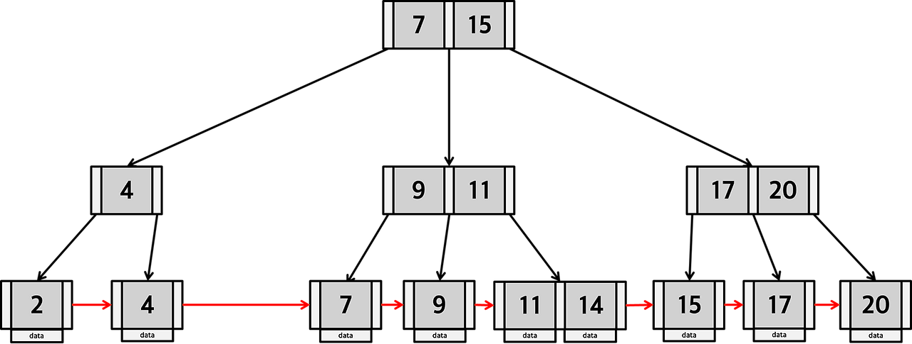
- B-Tree의 변형
- 리프 노드에만 데이터를 저장하고, 리프 노드가 아니라면 자식의 Key 값을 저장
- 리프 노드는 연결리스트로 구성되어 있어 인접한 다음 노드에 바로 접근 가능하며, 범위 검색에 효율적
- 대부분의 RDB의 인덱스 기본 구조

#### DB 인덱스가 B+Tree를 사용하는 이유
1. 디스크 I/O 효율성
> - 상위 노드에는 키만 저장하기 때문에 한 페이지에 더 많은 키 저장이 가능함. 즉, 트리 높이가 줄어들기 때문에 디스크 접근 횟수 최소화
> - DB는 메모리보다 훨씬 느린 디스크 기반 구조이고, 한번에 데이터를 가져올 때는 페이지 단위(16KB)로 읽음. B+Tree에서는 내부 노드가 작고, 한 페이지에 훨씬 많은 키를 저장할 수 있음. (=fan-out이 크다) 따라서 트리의 높이가 낮아지고, 탐색할 때 디스크 I/O가 줄어드는 것
2. Range Query 효율
> 리프 노드들이 연결 리스트 형태로 연결되어 있으므로 범위 검색 시 값을 한번 찾은 후 연속 스캔만으로 조회 가능 (B-Tree의 경우 상위 노드를 순회 반복해야 하므로 비효율적)
3. 균일한 탐색 비용
> 모든 실제 데이터가 리프 노드에만 존재하기 때문에 모든 탐색 경로 길이가 동일하고, O(logN)이라는 시간복잡도를 일정하게 유지 가능

### 그렇다면, B+Tree가 B-Tree에 비해 반드시 좋다고 할 수 있을까요? 그렇지 않다면 어떤 단점이 있을까요?
- 범위 검색보다 단건 검색이 많은 경우 데이터를 찾기 위해 무조건 리프까지 내려가야 하므로 B-Tree보다 한 단계 더 깊음


### DB에서 RBT를 사용하지 않고, B-Tree/B+Tree를 사용하는 이유가 있을까요?
- 디스크를 접근해야 하는 DBMS 환경에서는 디스크 I/O 효율이 절대적으로 중요하기 때문에 메모리 기반에서 최적화된 RBT보다 디스크 접근을 최소화하는 B/B+Tree가 훨씬 적합함
  - RBT는 메모리 기반 탐색으로, 트리의 높이가 매우 높다. 또한 CPU 캐시와 메모리 주소 접근을 전제로 설계된 트리이다.
  - B+Tree는 디스크 기반 탐색으로, 트리의 높이가 훨씬 얕다. 또한 디스크 블록 I/O를 최소화하도록 설계된 트리이다. 
- 디스크 페이지(Locality) 측면
  - RBT는 모든 노드가 개별 객체로 메모리에 흩어져있음 → 디스크에서는 랜덤 I/O 발생
  - B+Tree는 한 노드 = 한 페이지 단위로 구성되어 여러 키를 연속 저장(Sequential I/O) 가능
  - 따라서 디스크 prefetching과 버퍼 캐시 효율이 훨씬 높음
- 예) 10억개의 레코드가 있을 때
  
  | 트리 종류  | 한 노드에 저장 가능한 키 수 | 필요 높이 (대략) |
  |--------|------------------|------------|
  | RBT    | 1                | 30         |
  | B+Tree | 100              | 4          |


### 오름차순으로 정렬된 인덱스가 있다고 할 때, 내림차순 정렬을 시도할 경우 성능이 어떻게 될까요? B-Tree/B+Tree의 구조를 기반으로 설명해 주세요.
- B+Tree의 경우 리프 노드가 양방향 연결리스트로 정렬되어 있기 때문에, 오름차순이든 내림차순이든 리프 노드를 역방향으로 순회하기만 하면 됨
  - PostgreSQL처럼 B+Tree 인덱스의 리프노드가 단방향으로만 연결되어 있는 경우 DESC 정렬 시 역방향 스캔을 지원하지만, 내부적으로는 반대 방향으로 페이지를 읽는 추가 오버헤드가 존재할 수 있ㅇㅁ
- B-Tree의 경우 리프 노드들이 서로 연결되어 있지 않기 때문에 순차 스캔은 트리를 계속 타고 올라갔다 내려가는 과정에서 랜덤 I/O가 많이 발생함. 
  - 오름차순의 경우 왼쪽에서 오른쪽으로 탐색 방향이 일정해서 페이지 접근 패턴이 부분적으로 순차적임
  - 내림차순의 경우 오른쪽에서 왼쪽으로 거슬러 올라가는 비순차 탐색이므로 디스크 기준으로 보면 랜덤 페이지 접근이 매번 일어나 오름차순일 때보다 성능이 더 저하됨

## 11. DB Locking에 대해 설명해 주세요.

### Optimistic Lock/Pessimistic Lock에 대해 설명해 주세요.
### 물리적인 Lock을 건다면, 만약 이를 수행중인 요청에 문제가 생겨 비정상 종료되면 Lock이 절대 해제되지 않는 문제가 생길 수도 있을 것 같습니다. DB는 이를 위한 해결책이 있나요? 없다면, 우리가 이 문제를 해결할 수 없을까요?

## 12. 트래픽이 높아질 때, DB는 어떻게 관리를 할 수 있을까요?

### DB 서버를 분산하지 않고, 트래픽을 감당할 수 있는 방법은 없을까요?


## 13. Schema가 무엇인가요?

### Schema의 3계층에 대해 설명해 주세요.

## 14. DB의 Connection Pool에 대해 설명해 주세요.

### DB와 Client가 Connection을 어떻게 구성하는지 설명해 주세요.


## 15. Table Full Scan, Index Range Scan에 대해 설명해 주세요.

### 가끔은 인덱스를 타는 쿼리임에도 Table Full Scan 방식으로 동작하는 경우가 있습니다. 왜 그럴까요?
### COUNT (개수를 세는 쿼리) 는 어떻게 동작하나요? COUNT(1), COUNT(*), COUNT(column) 의 동작 과정에는 차이가 있나요?


## 16. SQL Injection에 대해 설명해 주세요.

### 그렇다면, 우리가 서버 개발 과정에서 사용하는 수많은 DB 라이브러리들은 이 문제를 어떻게 해결할까요?
